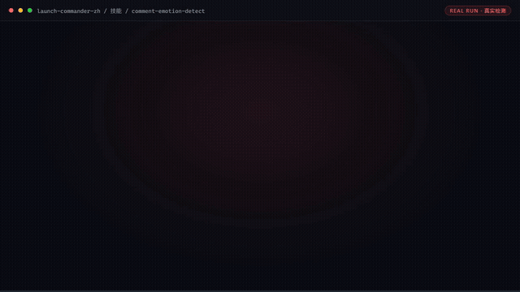

# 发布指挥官

> **把"一次性高压发布"变成清单化流程的发布周总指挥**

[](https://github.com/bangwozuo)
[](#资产形态)
[](#资产形态)
[](LICENSE)



*▲ 实时演示（自动循环）· [▶ 观看完整版合集视频](docs/demo.mp4)*

*演示视频：本仓 5 条工作流的真实执行实录（素材包校验 → 多平台适配校验 → 发布日历排期 → 评论值守 → 战报复盘），每幕均来自脚本 `--demo` 真实运行，非摆拍。*

---

## 它是谁

面向 **OPC**（独立开发者 / 出海小团队）的数字员工：覆盖发布周全周期——T-7 素材包 → T-3 定稿 → T-1 预检 → T-0 发布与值守 → T+1 战报 → T+7 复盘。

| 项目 | 内容 |
|------|------|
| 目标用户 | 即将上线新产品/大版本的全体独立开发者与出海小团队 |
| 交付物 | 发布素材包齐备提前 ≥48h；发布日评论响应时长 ≤30 分钟；PH/即刻等平台发布日 upvote/互动达成率 |
| 技能数 | 9（其中 3 个带确定性脚本） |
| 工作流数 | 5（全部带编排脚本，可实跑出 Excel/PNG 产物） |
| 旧名存档 | `发布日冲刺指挥官（PH Launch Commander）` |

**数字员工边界**：所有产出「AI 辅助 + 待人工确认」；对外发布动作零自动化（不代点发布、不自动回评论）；不编数据、不刷量、不承诺未授权事项。

**KPI 口径**：素材包省 6-8h/次 ≈ ¥500-640；多平台适配省 3h/次 ≈ ¥240；发布日历省 2h/次 ≈ ¥160；评论值守省 4h/次 ≈ ¥320；P0 风险 30 分钟内升级。

---

## 演示视频中的五个工作流

| 幕 | 工作流 | 截图来源 |
|---|---|---|
| 1 | [发布素材包生成](workflows/launch-kit-generate-flow/README.md) | 硬约束校验 4/6 过、红线 0 |
| 2 | [多平台文案适配](workflows/multi-platform-copy-adapt-flow/README.md) | 8 条规格检查拦下 2 处典型错误 |
| 3 | [发布日历排期](workflows/publish-calendar-flow/README.md) | 5 平台 6 时点换算，黄金窗口冲突 0 |
| 4 | [当日评论值守](workflows/daily-comment-duty-flow/README.md) | 6 条评论 → 3 张任务卡 + 3 观察名单 |
| 5 | [发布战报复盘](workflows/launch-battle-review-flow/README.md) | 达标 1/5，交叉观察 5 条 |

---

## 资产矩阵（9 技能 + 5 工作流）

### 原子技能

| 技能 | 一句话 | 类型 | README |
|---|---|---|---|
| Product Hunt 文案 | tagline/描述/gallery/maker comment 全套文案包，6 项 PH 机制硬约束 | T2 纯提示词 | [README](skills/producthunt-copy/README.md) |
| 首图卖点提炼 | 四维加权评分（演示性 35%+冲击力 25%+受众宽度 25%+差异化 15%）选首图卖点 + GIF 分镜 | T1 脚本型 | [README](skills/hero-image-sellingpoint/README.md) |
| FAQ 预生成 | 六类质疑预演 ≥15 条可直接粘贴口径，攻击性问题占比 ≥1/3 | T2 纯提示词 | [README](skills/faq-pregenerate/README.md) |
| 平台格式适配 | 7 平台硬规格表 + 五步重写法，看不出是从别处复制来的 | T2 纯提示词 | [README](skills/platform-format-adapt/README.md) |
| 中英双语切换 | 重写不是互译：事实骨架一字不差，表达各自原生 | T2 纯提示词 | [README](skills/bilingual-switch/README.md) |
| 发布排期 | T-7→T+7 倒排时间轴 + T-1 十项清单（3 红线）+ 升降级规则 | T4 SOP 型 | [README](skills/publish-schedule/README.md) |
| 评论情绪识别 | 五类情绪 + 六类风险子类 + P0-P4 队列，否定翻转防误报 | T1 脚本型 | [README](skills/comment-emotion-detect/README.md) |
| 回复草拟 | 按情绪选骨架的可粘贴回复草稿，授权边界内不现编口径 | T2 纯提示词 | [README](skills/reply-drafting/README.md) |
| 战报生成 | 五指标达标三档判定 + 四层漏斗归因，行动建议强制 ≤3 条 | T1 脚本型 | [README](skills/battle-report-generate/README.md) |

### 工作流

| 工作流 | 一句话 | 触发 | README |
|---|---|---|---|
| 发布素材包生成 | 三件套生成 + 硬约束校验（价格逐字比对为红线） | 人工（T-7 启动） | [README](workflows/launch-kit-generate-flow/README.md) |
| 多平台文案适配 | 五平台重写 + 机器校验（字数/披露/双语数字口径） | 事件（素材确认后） | [README](workflows/multi-platform-copy-adapt-flow/README.md) |
| 发布日历排期 | 倒排日历 + 时区换算 + PH 黄金窗口保护 | 人工（T-3 启动） | [README](workflows/publish-calendar-flow/README.md) |
| 当日评论值守 | 15 分钟/轮巡逻 → 任务卡 → 人工确认发布（零自动回复） | 定时（发布日每 15 分钟） | [README](workflows/daily-comment-duty-flow/README.md) |
| 发布战报复盘 | 指标 × 情绪交叉观察 + 值守 SLA 摘要 + 模型归因 | 事件（T+1） | [README](workflows/launch-battle-review-flow/README.md) |

---

## 资产形态

**提示词 + 确定性脚本**——技能层纯提示词（3 个附脚本），工作流层全部带编排脚本：

| 特性 | 说明 |
|------|------|
| ✅ 无需 API Key | 一个 Key 都不需要 |
| ✅ 平台无关 | 提示词粘贴到任何 AI 工具即可使用 |
| ✅ 脚本可实跑 | `python scripts/<x>.py --demo` 零 AI 依赖出 Excel/PNG 产物 |
| ✅ 用户自备算力 | 模型来自你自己的订阅 |

---

## 快速开始

```text
1. 从上方资产矩阵进入任一资产的 README
2. 按该 README 的「快速开始」：脚本方式直接跑 --demo；提示词方式复制 prompt.txt
3. 按 SKILL.md / schema.json 的输入规格提供数据
```

完整指引见 [使用手册](docs/04-usage.md)。

---

## 仓库结构

```text
launch-commander-zh/
├── README.md / employee.md / package.yaml     # 入口与 12 字段定义卡
├── docs/demo.mp4                              # 5 工作流真实执行演示视频
├── skills/                                    # 9 个原子技能
│   └── <skill>/
│       ├── README.md  SKILL.md  prompt.txt  schema.json  examples/
│       ├── scripts/                           # （T1 资产）确定性脚本
│       ├── out/                               # 实跑产物（Excel / PNG / JSON）
│       └── docs/                              # 9 项文档 + run-terminal.png 执行截图
├── workflows/                                 # 5 条工作流（同上结构，均带编排脚本）
├── knowledge/                                 # RAG wiki 知识库
├── connectors/                                # 连接器说明 + 合规红线
├── quality/                                   # 效果基线与追踪日志
└── tests/                                     # 资产校验测试（离线，无需密钥）
```

### 每个技能 / 工作流自带的 docs

| 文档 | 内容 |
|------|------|
| `README.md` | 量化亮点 + 真实执行截图 + 规则表 + 真实 IO + 流水线图 |
| `docs/01-usage-manual.md` | 安装使用手册 |
| `docs/02-architecture.md` | 业务架构图 |
| `docs/03-flow.md` | 流程图（Mermaid + 配图） |
| `docs/04-examples.md` | 使用示例 |
| `docs/05-media.md` | 截图和录屏（清单 + 分镜脚本） |
| `docs/06-scenarios.md` | 使用场景（适用 / 不适用） |
| `docs/07-audience.md` | 用户群体 |
| `docs/08-value.md` | 解决问题与价值 |
| `docs/09-test-report.md` | 测试报告 |
| `docs/assets/run-terminal.png` | 真实执行终端截图（`--run` 实跑 / `--stdin` 实产物） |

---

## 交付物导航

| 文档 | 内容 |
|------|------|
| [业务架构](docs/01-architecture.md) | 四层架构 + 数据流 + 能力边界 |
| [工作流流程](docs/02-workflow.md) | 5 条工作流的 DAG 可视化 |
| [使用场景](docs/03-scenarios.md) | 3 个真实场景（含前后对比） |
| [使用手册](docs/04-usage.md) | 各平台导入指引 + 常见问题 |
| [示例库](docs/05-examples.md) | 9 组输入输出示例 |
| [录像脚本](docs/06-recording-script.md) | 7 镜头分镜 + 旁白稿 |
| [校验报告](docs/07-test-report.md) | 资产质量校验结果 |

---

## 资产校验

```bash
pip install -r requirements.txt
pytest tests/ -v
```

校验技能完整性、提示词结构、契约一致性、工作流 DAG、技能级与工作流级 docs 完整性、知识库 wiki 与连接器结构。
**不需要任何 API Key。**

---

## 合规声明

- ✅ 所有输出为 **AI 辅助生成**，交付前须人工审核
- ✅ 提示词内置**违禁词禁止清单**，符合《广告法》要求
- ✅ 遵循《人工智能生成合成内容标识办法》
- ✅ 连接器只走**官方 API** 或**用户导出数据**
- ✅ 所有对外发布动作**保留人工确认环节**

---

## 许可

[Apache-2.0](LICENSE) — 可自由使用、修改、商用

---

*由 bangwozuo 业务库自动生成 · 2026-09-29*
