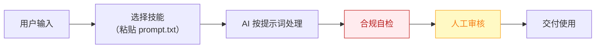

# 发布指挥官 — 业务架构

## 四层视图

```mermaid
flowchart TD
    subgraph L1["① 用户层"]
        U["即将上线新产品/大版本的全体独立开发者与出海小团队"]
    end

    subgraph L2["② 数字员工层"]
        E["发布指挥官<br/>把"一次性高压发布"变成清单化流程的发布周总指挥"]
    end

    subgraph L3["③ 工作流层（5 条）"]
        W1["发布素材包生成"]
        WN["…共 5 条"]
    end

    subgraph L4["④ 原子技能层（9 个）"]
        SK1["Product Hunt 文案"]
        SK2["首图卖点提炼"]
        SK3["FAQ 预生成"]
        SK4["平台格式适配"]
        SK5["中英双语切换"]
        SK6["发布排期"]
        SK7["评论情绪识别"]
        SK8["回复草拟"]
        SK9["战报生成"]
    end

    U -->|"提出需求"| E
    E -->|"编排调用"| W1
    W1 --> WN
    W1 --> SK1

    style L1 fill:#E8F4FD,stroke:#1976D2,color:#0D47A1
    style L2 fill:#FFF3E0,stroke:#E65100,color:#BF360C
    style L3 fill:#F3E5F5,stroke:#7B1FA2,color:#4A148C
    style L4 fill:#E8F5E9,stroke:#388E3C,color:#1B5E20
```

## 资产形态说明

本资产包为**纯提示词客户端资产**：

| 特性 | 说明 |
|------|------|
| 无运行时依赖 | 不调用任何模型 API，不需要 API Key |
| 平台无关 | 提示词为纯文本，可导入任意主流 AI 平台 |
| 用户自备算力 | 模型由用户自己的订阅提供 |
| 零服务端成本 | 资产方不产生任何调用费用 |

## 数据流



> **关键设计**：所有对外输出必须经过「合规自检 → 人工审核」双闸门。

## 能力边界

| 维度 | 内容 |
|------|------|
| **目标用户** | 即将上线新产品/大版本的全体独立开发者与出海小团队 |
| **做** | 素材包生成、多平台文案、发布日历、当日评论监控与回复建议、战报复盘 |
| **不做** | 不做：代刷票/虚假评论、承诺榜单名次 |
| **KPI** | 发布素材包齐备提前 ≥48h；发布日评论响应时长 ≤30 分钟；PH/即刻等平台发布日 upvote/互动达成率 |
| **定价** | ¥99-199/月 或 **¥99/次**；ROI 汇总：单次发布省 15h+ ≈ ¥1200 vs ¥99/次，回报比 >12 倍 |

---

*本图由 build_p0_assets.py 自动生成*
