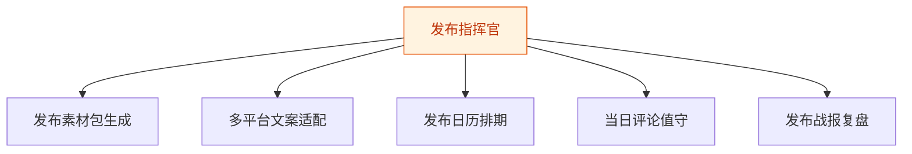
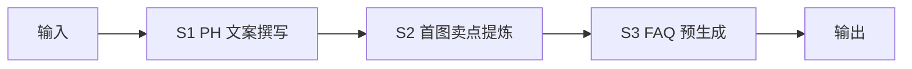
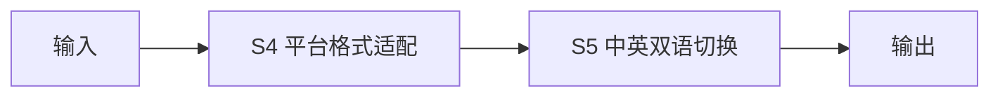
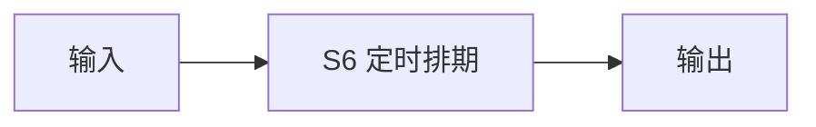
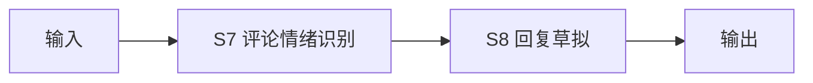
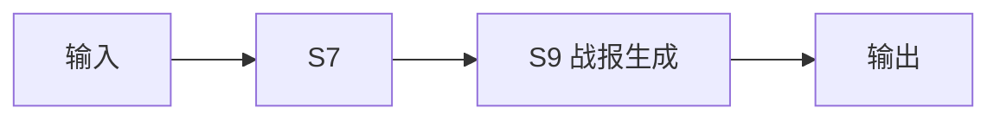

# 发布指挥官 — 工作流流程图

本员工共 **5 条工作流**，下辖 **9 个原子技能**。

## 总览

## 分条详情

### 发布素材包生成

| 项目 | 内容 |
|------|------|
| 触发 | 人工（T-7 天启动） |
| 复杂度 | `S` |
| 阶段 | `P0` |
| ROI | 省 6-8h/次 ≈ ¥500-640/次 |

### 多平台文案适配

| 项目 | 内容 |
|------|------|
| 触发 | 事件（素材确认后） |
| 复杂度 | `S` |
| 阶段 | `P0` |
| ROI | 省 3h/次 ≈ ¥240/次 |

### 发布日历排期

| 项目 | 内容 |
|------|------|
| 触发 | 人工（T-3 天） |
| 复杂度 | `S` |
| 阶段 | `P0` |
| ROI | 省 2h/次 ≈ ¥160/次 |

### 当日评论值守

| 项目 | 内容 |
|------|------|
| 触发 | 定时（发布日每 15 分钟） |
| 复杂度 | `M` |
| 阶段 | `P1` |
| ROI | 省发布日 4h 盯屏 ≈ ¥320/次 |

### 发布战报复盘

| 项目 | 内容 |
|------|------|
| 触发 | 事件（T+1） |
| 复杂度 | `S` |
| 阶段 | `P1` |
| ROI | 沉淀资产，间接 ROI |

## 汇总表

| # | 工作流 | 阶段 | 复杂度 | 触发 | 涉及技能数 |
|---|--------|------|--------|------|-----------|
| 1 | 发布素材包生成 | `P0` | `S` | 人工（T-7 天启动） | 3 |
| 2 | 多平台文案适配 | `P0` | `S` | 事件（素材确认后） | 2 |
| 3 | 发布日历排期 | `P0` | `S` | 人工（T-3 天） | 1 |
| 4 | 当日评论值守 | `P1` | `M` | 定时（发布日每 15 分钟） | 2 |
| 5 | 发布战报复盘 | `P1` | `S` | 事件（T+1） | 2 |

---

*本图由 build_p0_assets.py 自动生成*
