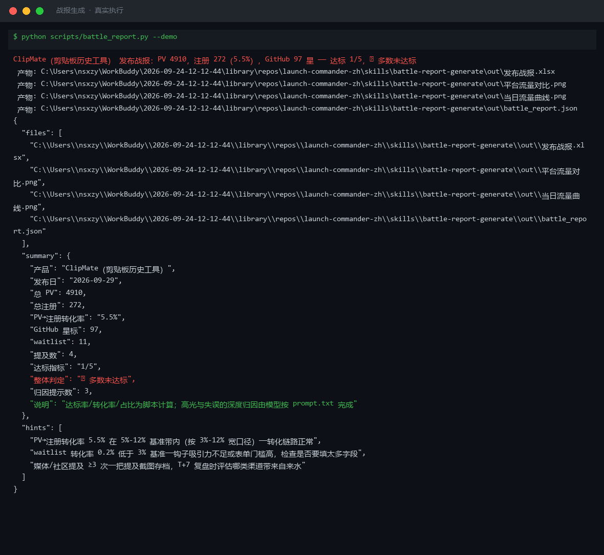
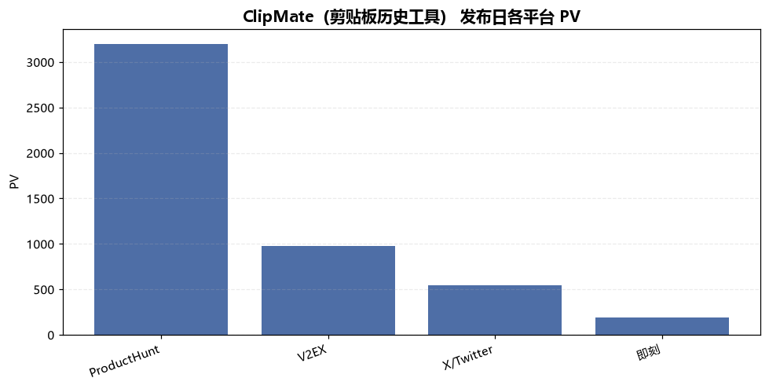
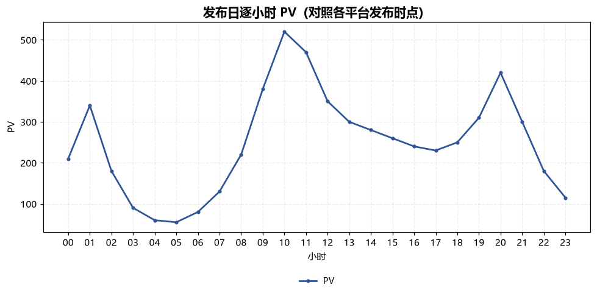
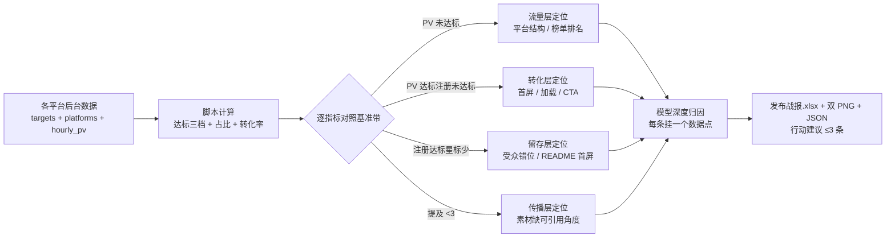

# 战报生成 Battle Report Generate

> 原子技能 ｜ 属于「发布指挥官」 ｜ OPC 客群（独立开发者/出海小团队） ｜ T1 产物型（脚本交付真实文件）
>
> **发布日 T+1 早上，把散落在 PH/V2EX/X/即刻的数据收拢成达标对照表和能指导 T+7 行动的复盘——不许写成流水账。**
> 五指标全部带基准口径 · 达标三档判定脚本已实现 · 四层漏斗归因（流量/转化/留存/传播）· 行动建议强制 ≤3 条



🎬 **[▶ 观看演示视频](docs/assets/demo.mp4)** — 四幕流转叙事：业务钩子 → 真实执行 → 数据管线节点动画 → 交付物

*上图来自真实执行：`python scripts/battle_report.py --demo` 退出码 0。内置样例（ClipMate 发布日：总 PV 4910、注册 272、转化率 5.5%、97 星）判定「达标 1/5，🔴 多数未达标」，给出 3 条归因提示，产物落盘 Excel + 2 张 PNG + JSON。*

---

## 它算什么（五指标口径 + 达标判定）

### 战报五指标（全部有参考基准）

| 指标 | 口径 | 参考基准 |
|---|---|---|
| PV | 各平台落地页/产品页访问合计 | 独立开发者发布日全平台 3k-15k |
| 注册数 | 完成注册/下载的去重用户 | PV→注册 5%-12%；<3% 是落地页问题 |
| GitHub 星标 | 发布日新增星 | PH 首日 100+ 属头部；<20 查 README 首屏 |
| waitlist 转化 | 订阅数 / PV | 3%-8%；<3% 查表单门槛 |
| 媒体与社区提及 | 独立提及数（转发不算） | ≥3 次独立提及算有效传播 |

### 达标三档（脚本实现）与四层漏斗归因

| 档位 | 判定 | 漏斗层 | 高发问题 |
|---|---|---|---|
| ✅ 达标 | 实际 ≥ 目标 100% | 流量层 | 单平台占比 >70% = 鸡蛋一个篮；PH 掉榜砍 60%+ 流量 |
| 🟡 部分达标 | 70%-100% | 转化层 | 首屏 5 秒讲不清是什么、加载 >3 秒、CTA 藏在第二屏以下 |
| 🔴 未达标 | <70% | 留存层 | 受众错位或 README 缺截图/缺「30 秒上手」 |
| 整体判定 | 全部 / 大部分（≥60% 指标达标）/ 多数未达标 | 传播层 | 提及 <3 = 素材包缺「可引用的角度」 |

时点效应纳入归因：PH 流量集中在 00:01-06:00 PT（榜单前十流量是 20 名外的 5-10 倍）；V2EX 上午 10 点发有效曝光 4-6 小时；X 双峰（9 AM / 8 PM EST）第二峰常被忽略。

## 真实输入 → 真实输出

**输入**（`examples/input.json`，ClipMate 发布日）：4 个平台 + 五指标目标 + 24 小时逐时 PV。

**输出**（脚本实跑，节选）：

| 指标 | 实际 | 目标 | 达标率 | 判定 |
|---|---|---|---|---|
| PV（页面访问） | 4910 | 5000 | 98% | 🟡 部分达标 |
| 注册数 | 272 | 300 | 91% | 🟡 部分达标 |
| GitHub 星标 | 97 | 100 | 97% | 🟡 部分达标 |
| waitlist 转化 | 11 | 200 | 6% | 🔴 未达标 |
| 媒体与社区提及 | 4 | 3 | 133% | ✅ 达标 |

脚本归因提示（实跑）：转化率 5.5% 在基准带内——链路正常；waitlist 转化 0.2% 低于 3% 基准——问题在表单不在产品；提及 ≥3 次——截图存档备 T+7 复盘。

完整战报见 [`examples/output.md`](examples/output.md)；实跑产物：

| 产物 | 内容 |
|---|---|
| `out/发布战报.xlsx` | 关键指标/平台明细/归因提示/汇总，未达标行标红 |
| `out/平台流量对比.png` | 各平台 PV/注册对比 |
| `out/当日流量曲线.png` | 24 小时逐时 PV（10 点 V2EX 峰与 20 点晚间峰清晰可见） |
| `out/battle_report.json` | 机器可读结果，供 launch-battle-review-flow 复用 |





## 处理流水线



## 快速开始

**方式一：脚本（零 AI 依赖，确定性计算）**

```bash
pip install openpyxl matplotlib
# 演示模式（内置真实样例）
python scripts/battle_report.py --demo
# 指定输入
python scripts/battle_report.py --input examples/input.json --outdir out
```

**方式二：提示词（深度归因，任意 AI 工具）**

```text
1. 打开 prompt.txt，全文复制
2. 粘贴到 Coze / WorkBuddy / Dify / Claude / ChatGPT
3. 把脚本输出的 battle_report.json 数值喂给模型，按 prompt 里的
   归因方法与战报格式产出「归因分析 + 高光失误 + 行动建议」
```

职责分工：确定性数值（达标率/转化率/占比）以脚本为准，**模型不许自己算**；模型的价值在深度归因和下一步建议。

## 面向谁 / 什么时候用

| ✅ 该用 | ❌ 别用 |
|---|---|
| 发布日 T+1 早上的达标判定与归因 | 用单日数据下长期结论（发布日有脉冲效应，周留存等 T+7） |
| 决定 T+7 是「乘胜追击」还是「止损换方向」 | 把 PV 当成绩汇报（PV 不转化就是带宽成本） |
| 批量对照五指标基准带，定位漏斗层 | 无目标值硬判达标（targets 未设时脚本降级为「未设目标」） |

## 边界与合规

- 本资产输出为 **AI 辅助生成内容**，对外分享战报前必须人工确认（含用户量数据属敏感信息）
- 只做汇总与初判：不编造数据、不用「行业平均」填补缺失指标，数据缺失列清单标「缺失」
- 不公开竞品对比数据（无授权引用第三方数据）；对外版本（博客月更）须去除转化率等商业敏感项

## 文件地图

```text
├── README.md                ← 本文件
├── SKILL.md                 ← 资产定义（元信息 / 契约 / 边界）
├── prompt.txt               ← 提示词本体（五指标口径 + 归因方法 + 输出格式）
├── schema.json              ← 输入输出契约（机器可读）
├── scripts/battle_report.py ← 确定性计算脚本（五指标 → Excel/双 PNG/JSON）
├── examples/                ← 真实输入 + 脚本实跑输出
├── docs/                    ← 9 项配套文档（架构 / 流程 / 场景 / 测试报告…）
└── out/                     ← 实跑产物（发布战报.xlsx / 平台流量对比.png / 当日流量曲线.png）
```

---

*本资产遵循 [bangwozuo 数字员工资产规范](https://github.com/bangwozuo/digital-employee-spec) v3.0 ｜ [所属员工：发布指挥官](../../) ｜ [总入口](https://github.com/bangwozuo/digital-employees-hub-zh)*
