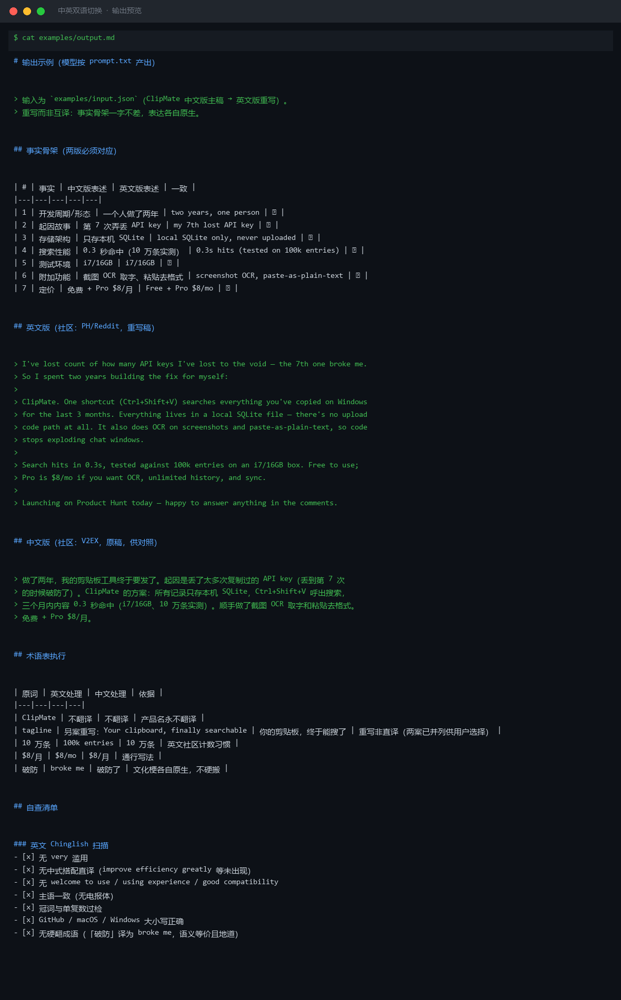
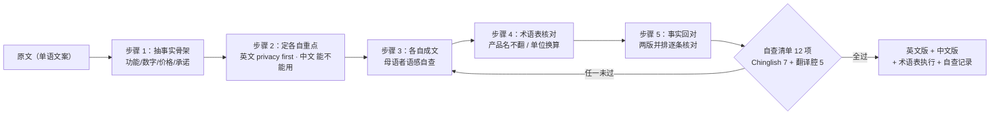

# 中英双语切换 Bilingual Switch

> 原子技能 ｜ 属于「发布指挥官」 ｜ OPC 客群（独立开发者/出海小团队） ｜ T2 纯提示词型
>
> **重写，不是互译（rewrite, not translate）——中文社区（V2EX/即刻）与英文社区（PH/Reddit/X）的受众、语感、笑点完全不同，产出两套各自原生的文案。**
> 五步重写工作流 · 术语处理 6 类规则 · 英文 Chinglish 自查 7 项 + 中文翻译腔自查 5 项 · 数字零漂移机器可比对




*上图来自 `examples/output.md` 实跑产物预览：ClipMate 中文主稿 → 英文版重写，事实骨架 7 条逐项一致，术语表 5 条执行完毕（ClipMate 不翻译、10 万条 → 100k entries、$8/月 → $8/mo）。*

---

## 它守什么（术语规则 + 语感对照）

### 术语处理规则（按类型）

| 类型 | 规则 | 例 |
|---|---|---|
| 产品名 | **永不翻译** | ClipMate 就是 ClipMate，不叫「剪贴大师」 |
| tagline | 通常不翻——若翻须重新创作而非直译 | `Your clipboard, finally searchable` 中文另写「你的剪贴板，终于能搜了」 |
| 技术词 | 用目标社区通行叫法 | 「本地存储」→ local-first；「截图取字」→ OCR |
| 单位/数字 | 换算并保留原文精度 | 10 万条 → 100k entries；$8/月 → $8/mo |
| 平台名 | 不翻 | Windows / GitHub / Product Hunt |
| 文化梗 | 不硬搬——英文 pun 中文多半无效 | 删掉或换成目标社区自己的梗 |

### 社区语感对照（写之前先读）

| 维度 | 英文社区（PH/Reddit/X） | 中文社区（V2EX/即刻） |
|---|---|---|
| 人称 | I / you，直接对话 | 「我」为主，可带「各位/大家」 |
| 语气 | confident + specific，允许幽默 | 克制 + 具体，反感营销腔 |
| 句长 | 短句，平均 <20 词 | 中短句，少用「您」 |
| emoji | PH/X 少量（≤2） | 即刻可用，V2EX 不用 |
| 谦辞 | 不用（pls support 减分） | 少用（「求轻喷」已过时） |

## 真实输入 → 真实输出

**输入**（`examples/input.json`）：ClipMate 中文版主稿 → 英文（PH/Reddit 社区），附术语表 4 条。

**输出**（事实骨架节选——两版必须一字不差对应的部分）：

| # | 事实 | 中文版表述 | 英文版表述 | 一致 |
|---|---|---|---|---|
| 1 | 开发周期/形态 | 一个人做了两年 | two years, one person | ✅ |
| 2 | 起因故事 | 第 7 次弄丢 API key | my 7th lost API key | ✅ |
| 3 | 存储架构 | 只存本机 SQLite | local SQLite only, never uploaded | ✅ |
| 4 | 搜索性能 | 0.3 秒命中（10 万条实测） | 0.3s hits (tested on 100k entries) | ✅ |
| 5 | 定价 | 免费 + Pro $8/月 | Free + Pro $8/mo | ✅ |

英文版重写稿开头（防 Chinglish 实样）：

> I've lost count of how many API keys I've lost to the void — the 7th one broke me.
> So I spent two years building the fix for myself: ClipMate.

完整输出见 [`examples/output.md`](examples/output.md)（含自查清单：英文 7 项 + 中文 5 项逐条勾选）。

## 处理流水线



## 快速开始

**提示词方式（3 步）**

```text
1. 打开 prompt.txt，全文复制
2. 粘贴到 Coze / WorkBuddy / Dify / Claude / ChatGPT
3. 按 schema.json 提供：原文 + 目标语言/社区 + 术语表（可选）
```

量化纪律：自查清单勾选率必须 100%；重写版与原文长度偏差 ≤50%；两版数字集合完全一致（multi-platform-copy-adapt-flow 会机器比对，改一个数字 = 两版同步改）。

## 面向谁 / 什么时候用

| ✅ 该用 | ❌ 别用 |
|---|---|
| 同一产品要发英文社区 + 中文社区 | 逐句互译——那叫翻译，不叫双语发布文案 |
| 英文版防 Chinglish（`using experience` 一出现就有人截图） | 翻译产品名；擅自决定 tagline 翻不翻（拿不准时两案并列让用户选） |
| 价格/数字/承诺两版口径必须一致 | 编造某一边社区的文化梗（用错梗比不用梗更尴尬） |

## 边界与合规

- 输出标注「AI 生成内容」，两版均人工确认后发布
- 术语表中用户提供指定译法的，严格按用户提供执行
- 两版中引用的用户评价/数据须同源同授权

## 文件地图

```text
├── README.md       ← 本文件
├── SKILL.md        ← 资产定义（元信息 / 契约 / 边界）
├── prompt.txt      ← 提示词本体（五步工作流 + 术语规则 + 双自查清单）
├── schema.json     ← 输入输出契约（机器可读）
├── examples/       ← 真实输入 + 输出（事实骨架 + 双语版 + 自查记录）
└── docs/           ← 9 项配套文档（架构 / 流程 / 场景 / 测试报告…）
```

---

*本资产遵循 [bangwozuo 数字员工资产规范](https://github.com/bangwozuo/digital-employee-spec) v3.0 ｜ [所属员工：发布指挥官](../../) ｜ [总入口](https://github.com/bangwozuo/digital-employees-hub-zh)*
