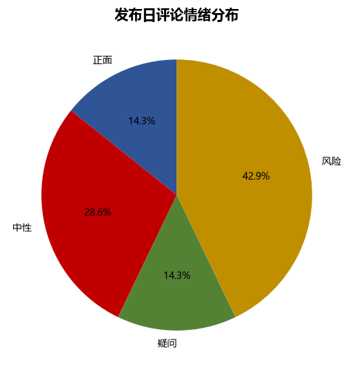
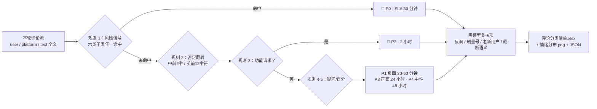

# 评论情绪识别 Comment Emotion Detect

> 原子技能 ｜ 属于「发布指挥官」 ｜ OPC 客群（独立开发者/出海小团队） ｜ T1 产物型（脚本交付真实文件）
>
> **发布日 2-4 小时涌入 50-300 条评论，把评论流快速切成「该立刻回 / 该认真回 / 该记录 / 不用回」四档——PH 首日评论响应速度直接影响排名算法。**
> 五类情绪标签 · 六类风险子类（每类带 SLA）· P0-P4 优先级队列 · 否定翻转防误报（脚本已实现）


*上图来自真实执行：`python scripts/emotion_scan.py --demo` 退出码 0。7 条评论判出「正 1 / 负 0 / 中 2 / 疑 1 / 风险 3」，P0+P1 共 3 条进优先队列，产物落盘 Excel + 情绪分布 PNG + JSON。*

---

## 它查什么（五类情绪 + 六类风险）

### 情绪五类标签

| 标签 | 判定标准 | 典型特征 |
|---|---|---|
| 🟢 正面 | 明确好评且无否定前缀 | 「终于有人做了」「finally」「game changer」 |
| ⚠️ 负面 | 明确差评/抱怨/流失信号 | 「崩溃」「太贵」「uninstall」「refund」 |
| ⚪ 中性 | 无情绪倾向的一般陈述 | 「mark」「已下载试试」 |
| 🔵 疑问 | 提问或功能请求，等待回答 | 「支持 Windows 吗」「希望加上 OCR」 |
| 🔴 风险 | 命中六类风险子类之一 | 见下表 |

### 六类风险子类（最高优先级，带 SLA）

| 子类 | 识别信号 | 标准处置 | SLA |
|---|---|---|---|
| 刷榜指控 | 「买量」「互赞群」「did you buy upvotes」 | 公开说明推广方式；不删帖不辩解 | 30 分钟 |
| 安全/隐私质疑 | 「数据上传哪」「权限范围」「telemetry」 | 数据流向说明 + 隐私政策链接 | 2 小时 |
| 退款诉求 | 「退款」「refund」「chargeback」 | 私信响应 + 公开回复处理进度 | 30 分钟 |
| 抄袭/竞品指控 | 「就是 XX 换皮」「copy of X」 | 承认相似点 + 列差异表；不攻击竞品 | 1 小时 |
| 存续质疑 | 「还能活多久」「跑路」 | 开发计划 + 更新日志链接 | 4 小时 |
| 水军指控 | 「假评论」「刷评论」 | 公布真实用户获取渠道，不反驳个体 | 1 小时 |

### 判定规则树（按顺序执行，命中即止）

1. **风险优先**：命中风险信号 → 🔴（即使其余是好评，「产品不错但数据上传哪」仍是风险）
2. **否定翻转**：「doesn't feel bloated」是好评不是差评；中文看前 2 字（不/没那么/并不），英文看前 12 字符
3. **建设性建议不算好评**：「希望加上 X」→ 🔵 疑问 + 功能请求标记——当好评回复会显得没读懂
4. **疑问优先于中性**：含问号/疑问词 → 🔵
5. **剩余按得分**：≥2 个正向词 → 🟢；明确差评 → ⚠️；其余 → ⚪

## 真实输入 → 真实输出

**输入**（`examples/input.json`）：7 条 PH/V2EX/即刻 评论（含退款诉求、抄袭+刷榜指控、隐私质疑各 1 条）。

**输出**（脚本实跑，优先级队列节选）：

| 队列位 | 平台 | 用户 | 摘录 | 情绪 | 风险子类 | 优先级 | SLA |
|---|---|---|---|---|---|---|---|
| 1 | ProductHunt | angry_bob | Crashed twice within 10 minutes… | 🔴 风险 | 退款诉求 | P0 | 30 分钟 |
| 2 | ProductHunt | skeptic_pete | This is just a copy of Paste… | 🔴 风险 | 抄袭/竞品指控 | P0 | 30 分钟 |
| 3 | V2EX | 隐私控 | 剪贴板数据会上传服务器吗？… | 🔴 风险 | 安全/隐私质疑 | P0 | 30 分钟 |
| 4 | ProductHunt | dev_sarah | Does it support Windows 11 dark mode?… | 🔵 疑问 | — | P2 | 2 小时 |
| 5 | ProductHunt | maker_fan99 | Congrats on the launch! Finally… | 🟢 正面 | — | P3 | 24 小时 |

防误报验证（同一次实跑）：「doesn't feel bloated」否定翻转生效未记差评；「希望加上 OCR…要是能支持就好了」未计为正面；「Crashed…how do I get a refund」命中退款整条升 P0。

完整输出见 [`examples/output.md`](examples/output.md)；实跑产物：

| 产物 | 内容 |
|---|---|
| `out/评论分类清单.xlsx` | 优先级队列 / 分类明细 / 汇总三 sheet，风险行标红 |
| `out/情绪分布.png` | 五类情绪分布图 |
| `out/emotion_scan.json` | 机器可读结果，供 daily-comment-duty-flow 复用 |



## 处理流水线



## 快速开始

**方式一：脚本（零 AI 依赖，确定性分类）**

```bash
pip install openpyxl matplotlib
# 演示模式（内置真实样例）
python scripts/emotion_scan.py --demo
# 指定输入 / 单条评论
python scripts/emotion_scan.py --input examples/input.json --outdir out
python scripts/emotion_scan.py --text "这个工具也太慢了吧" --platform V2EX
```

**方式二：提示词（语境复核，任意 AI 工具）**

```text
1. 打开 prompt.txt，全文复制
2. 粘贴到 Coze / WorkBuddy / Dify / Claude / ChatGPT
3. 喂入评论流；脚本不做的反讽/刷量号/语境判断由模型在「需模型复核项」中列出
```

数值（各档计数、占比、队列排序）以脚本输出为准，模型不要自己算。

## 面向谁 / 什么时候用

| ✅ 该用 | ❌ 别用 |
|---|---|
| 发布日（尤其 PH 首日）评论流的分级排队 | 写回复内容（那是 reply-drafting 的事，本技能只识别、分级、排队） |
| P0 风险 30 分钟内升级给开发者本人 | 删负面评论、引导用户删帖（删帖被发现会引爆二次舆情） |
| 健康度监控：正面 ≥60% 且风险=0；负面 >20% 触发置顶澄清 | 把功能请求当好评汇报（会高估情绪、误判 PMF） |

## 边界与合规

- 所有输出标注「AI 生成内容」，动作全部「待人工确认」后才执行；不执行自动回复
- 评论内容属用户数据：分类清单仅限发布值守使用，不外发、不公开用户 ID 全文截图（好评引用须获授权）
- 评论流为空时输出「发布日 0 评论」并提示检查发布链接，不填默认值

## 文件地图

```text
├── README.md                ← 本文件
├── SKILL.md                 ← 资产定义（元信息 / 契约 / 边界）
├── prompt.txt               ← 提示词本体（五类情绪 + 六类风险 + 规则树 + SLA 表）
├── schema.json              ← 输入输出契约（机器可读）
├── scripts/emotion_scan.py  ← 确定性分类脚本（规则树 → Excel/PNG/JSON）
├── examples/                ← 真实输入 + 脚本实跑输出
├── docs/                    ← 9 项配套文档（架构 / 流程 / 场景 / 测试报告…）
└── out/                     ← 实跑产物（评论分类清单.xlsx / 情绪分布.png）
```

---

*本资产遵循 [bangwozuo 数字员工资产规范](https://github.com/bangwozuo/digital-employee-spec) v3.0 ｜ [所属员工：发布指挥官](../../) ｜ [总入口](https://github.com/bangwozuo/digital-employees-hub-zh)*
