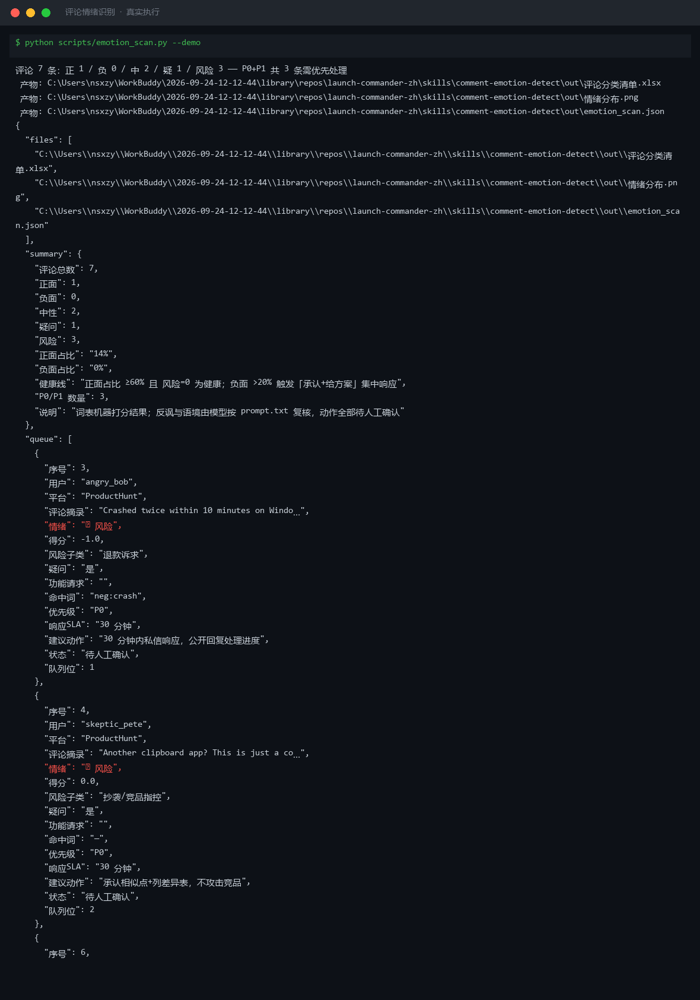

# 截图与录屏

> 以下素材均来自**真实执行**：`--run` 实拍终端 / 实跑产物文件，无摆拍。

## 演示视频


*第二帧为实跑产物图表*

## 执行截图



## 实跑产物

| 文件 | 说明 |
|---|---|
| [`out/emotion_scan.json`](out/emotion_scan.json) | 结构化结果（实跑生成） · 4 KB |
| [`out/情绪分布.png`](out/情绪分布.png) | 图表产物（实跑生成） · 26 KB |
| [`out/评论分类清单.xlsx`](out/评论分类清单.xlsx) | Excel 工作簿（实跑生成） · 10 KB |


---

## 附录：实跑输出明细

> 本资产为纯提示词客户端资产，无界面可截图。以下为**实跑运行效果**。

## 运行效果

### 输入

```json
{
  "items": [
    "示例条目 A",
    "示例条目 B"
  ],
  "taxonomy": "（分类体系：类别定义与判定标准（可选，缺省由你提出））"
}

```

### 输出

## 分类结果

| # | 条目 | 类别 | 判定依据 |
|---|---|---|---|
| 1 | 示例条目 A | 中性 | 文本为无情感倾向的占位短语，不含褒贬词汇 |
| 2 | 示例条目 B | 中性 | 同上，无明确情绪信号 |

> **AI 生成内容**

## 分布统计

| 类别 | 数量 | 占比 |
|---|---|---|
| 中性 | 2 | 100% |

## 存疑项

1. 输入条目为占位文本（"示例条目 A/B"），缺乏真实评论内容，分类结果不具备业务参考价值。
2. taxonomy 为占位提示，未提供真实分类体系，本次按正/负/中性三分类执行；如需自定义体系，请补充定义。


---

*运行效果由实跑验证生成*
