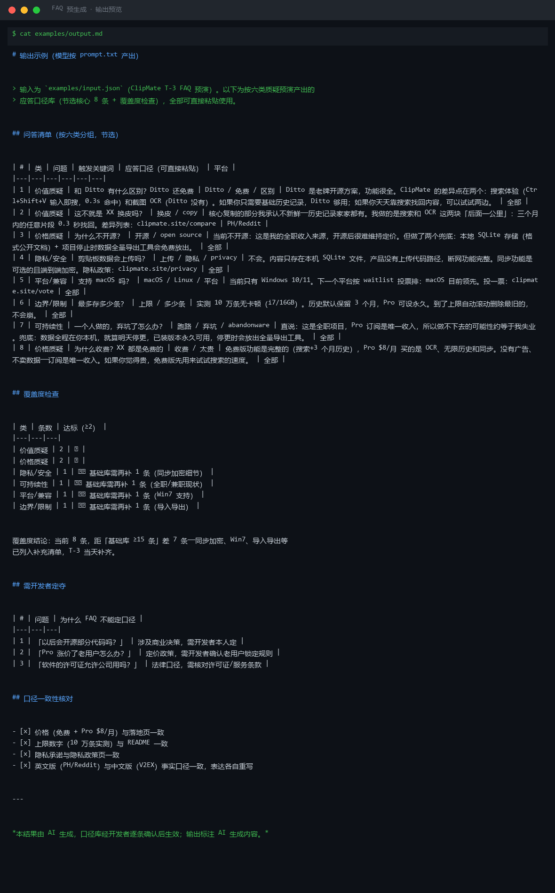
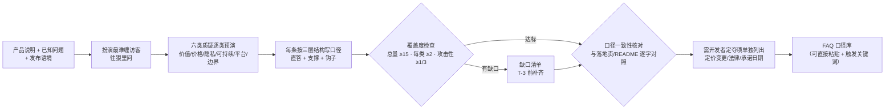

# FAQ 预生成 FAQ Pregenerate

> 原子技能 ｜ 属于「发布指挥官」 ｜ OPC 客群（独立开发者/出海小团队） ｜ T2 纯提示词型
>
> **T-3 扮演最难缠的访客，把发布日会被问、会被怼、会被质疑的问题提前打完——每条答案都能直接复制粘贴到评论区。**
> 六类质疑预演（价值/价格/隐私/可持续/平台/边界）· 基础库 ≥15 条且攻击性问题占比 ≥1/3 · 应答三层结构（直答+支撑+钩子）· 无口径问题转人工




🎬 **[▶ 观看高清完整版（mp4）](https://cdn.jsdelivr.net/gh/bangwozuo/launch-commander-zh@main/skills/faq-pregenerate/docs/assets/demo.mp4)** — 四幕流转叙事：业务钩子 → 真实执行 → 数据管线节点动画 → 交付物

*上图来自 `examples/output.md` 实跑产物预览：ClipMate T-3 预演产出 8 条可粘贴口径（含和 Ditto 对比、为什么不开源、数据会上传吗等攻击性问题），覆盖度检查暴露 4 类缺口。*

---

## 它预演什么（六类质疑，每类至少 1 条）

| 类 | 访客真正在问 | 应答要点 | 禁忌 |
|---|---|---|---|
| 价值质疑 | 「和 XX 比有什么区别？」「为什么不直接用 XX？」 | 承认竞品优点 → 讲差异点（1-2 个，具体）→ 给适用边界 | ❌ 贬低竞品；❌「我们更人性化」空词 |
| 价格质疑 | 「为什么收费/为什么不开源？」 | 讲成本结构 → 免费版给足 → 定价依据 | ❌ 道歉式定价；❌ 编造成本故事 |
| 隐私/安全 | 「数据传到哪？」「离线能用吗？」 | 一句话讲清数据流向 → 给隐私政策链接 | ❌ 口头保证「绝对安全」；❌ 回避不答 |
| 可持续性 | 「一个人做，能活多久？」 | 讲现状 → 讲离线兜底（数据导出/开源承诺） | ❌ 画大饼；❌ 装有团队 |
| 平台/兼容 | 「支持 macOS 吗？」「Win7 呢？」 | 明确当前支持 → 排期原则（按需求量投票） | ❌ 承诺日期（除非已定）；❌「考虑中」糊弄 |
| 边界/限制 | 「最大支持多少条？」 | 给真实上限数字 → 说超了会怎样 → 给变通方案 | ❌ 说「无限制」（必有上限）；❌ 隐瞒限制 |

### 应答口径的三层结构（每条答案都这么写）

1. **直接回答**（1 句）：能/不能/是/不是 + 关键数字。不许绕。
2. **一句话支撑**（1-2 句）：原因、依据或替代方案。
3. **钩子**（可选，1 句）：把对话续上——「如果你需要 XX，欢迎在 issue 里说」。

## 真实输入 → 真实输出

**输入**（`examples/input.json`）：ClipMate 产品说明 + 6 个已知问题 + 发布语境（PH + V2EX/即刻）。

**输出**（实跑节选——可直接粘贴级）：

| # | 类 | 问题 | 应答口径（节选） |
|---|---|---|---|
| 1 | 价值质疑 | 和 Ditto 有什么区别？Ditto 还免费 | Ditto 是老牌开源方案，功能很全。ClipMate 的差异点在两个：搜索体验（Ctrl+Shift+V 输入即搜，0.3s 命中）和截图 OCR（Ditto 没有）。如果只要基础历史记录，Ditto 够用。 |
| 3 | 价格质疑 | 为什么不开源？ | 当前不开源：这是我的全职收入来源。但做了两个兜底：本地 SQLite 存储（格式公开文档）+ 项目停止时数据全量导出工具会免费放出。 |
| 4 | 隐私/安全 | 剪贴板数据会上传吗？ | 不会。内容只存在本机 SQLite 文件，产品没有上传代码路径，断网功能完整。隐私政策：clipmate.site/privacy |
| 7 | 可持续性 | 一个人做的，弃坑了怎么办？ | 直说：这是全职项目，做不下去的可能性约等于我失业。兜底：数据全程在你本机，停更时会放出全量导出工具。 |

覆盖度检查（实跑）：8 条中价值/价格两类达标（各 2 条），隐私/可持续/平台/边界四类各差 1 条——缺口显式列出，T-3 当天补齐到 ≥15 条。「以后会开源吗」「涨价老用户怎么办」等 3 条标「需开发者定夺」，FAQ 不擅自定口径。

完整输出见 [`examples/output.md`](examples/output.md)。

## 处理流水线



## 快速开始

**提示词方式（3 步）**

```text
1. 打开 prompt.txt，全文复制
2. 粘贴到 Coze / WorkBuddy / Dify / Claude / ChatGPT
3. 按 schema.json 提供：产品说明 + 已知问题 + 发布语境（平台/日期/受众）
```

口径一致性纪律：同一事实全库只用一种说法（价格、上限、隐私承诺逐字一致）；英文社区与中文社区各自重写不互译，但事实口径一字不差。产出的口径库经开发者逐条确认后，供 daily-comment-duty-flow 值守匹配使用。

## 面向谁 / 什么时候用

| ✅ 该用 | ❌ 别用 |
|---|---|
| T-3（发布前 3 天）的口径库弹药准备 | 编造数据上限、兼容范围、性能数字（没有就标「需开发者提供」） |
| 攻击性问题预演（「这不就是 XX 抄的吗」） | 写「我们高度重视用户隐私」这类公关空话（要写数据流向事实） |
| 发布日 30 分钟内要回复、没口径库只能抓瞎的场景 | 在 FAQ 里承诺未定的日期与功能（路线图外承诺 = 给挖坑） |

## 边界与合规

- 输出标注「AI 生成内容」，口径库经开发者逐条确认后生效
- 应答中引用的用户数据/评价须获授权
- 涉及隐私承诺须与隐私政策实际内容一致，不一致以政策为准并修正 FAQ；法律问题（许可证/版权/合规）一律转人工

## 文件地图

```text
├── README.md       ← 本文件
├── SKILL.md        ← 资产定义（元信息 / 契约 / 边界）
├── prompt.txt      ← 提示词本体（六类质疑 + 三层结构 + 覆盖度标准）
├── schema.json     ← 输入输出契约（机器可读）
├── examples/       ← 真实输入 + 输出（口径库 + 覆盖度检查 + 需定夺项）
└── docs/           ← 9 项配套文档（架构 / 流程 / 场景 / 测试报告…）
```

---

*本资产遵循 [bangwozuo 数字员工资产规范](https://github.com/bangwozuo/digital-employee-spec) v3.0 ｜ [所属员工：发布指挥官](../../) ｜ [总入口](https://github.com/bangwozuo/digital-employees-hub-zh)*
