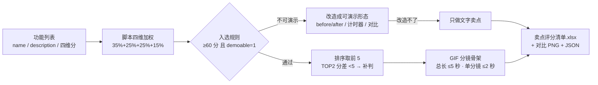

# 首图卖点提炼 Hero Image Sellingpoint

> 原子技能 ｜ 属于「发布指挥官」 ｜ OPC 客群（独立开发者/出海小团队） ｜ T1 产物型（脚本交付真实文件）
>
> **PH 首图平均停留不到 3 秒——从功能列表里挑出「值得上首图的那 3-5 个」，并配 GIF 分镜骨架。你不做图，你决定做什么图、突出什么、舍弃什么。**
> 四维加权评分（演示性 35% + 冲击力 25% + 受众宽度 25% + 差异化 15%）· 入选规则脚本已实现（≥60 分且可演示，取前 5）· 每个高分必须挂证据


🎬 **[▶ 观看高清完整版（mp4）](https://cdn.jsdelivr.net/gh/bangwozuo/launch-commander-zh@main/skills/hero-image-sellingpoint/docs/assets/demo.mp4)** — 四幕数据叙事：业务钩子 → 真实执行 → 指标条形图生长 → 交付物

*上图来自真实执行：`python scripts/sellingpoint_score.py --demo` 退出码 0。5 个功能加权评分后入选 4 个，TOP1 = 全局历史搜索（90.0 分），并检出 1 个不可演示功能（端到端加密同步）不做 GIF。*

---

## 它评什么（四维评分标准）

| 维度 | 权重 | 5 分标准 | 1 分标准 |
|---|---|---|---|
| 演示性 demoable | 35% | 一屏 GIF 能演示完 | 纯后端特性，画面无从下手 |
| 冲击力 wow | 25% | 看到演示会「哦！」出声 | 需要解释才知道好在哪 |
| 受众宽度 breadth | 25% | 目标用户里 ≥80% 用得上 | <20% 的人用得上 |
| 差异化 uniqueness | 15% | 同类产品没做过/没做好 | 全员标配 |

打分纪律：**每个 4-5 分必须挂证据**（用户原话、竞品对照、埋点数据），没证据的给 3 分——「我觉得很惊艳」不算证据。

入选规则（脚本实现）：综合得分 ≥60 且可演示 → 首图/GIF 候选，取前 5；TOP2 分差 <5 分说明主卖点不突出；入选 <3 个先补录屏素材再重评，不硬凑弱卖点。

## 真实输入 → 真实输出

**输入**（`examples/input.json`，ClipMate 的 5 个功能）：每个功能带 demoable/wow/breadth/uniqueness 四维分。

**输出**（脚本实跑）：

| 排名 | 卖点 | 演示性 | 冲击力 | 受众宽度 | 差异化 | 得分 | GIF 类型 | 入选 |
|---|---|---|---|---|---|---|---|---|
| 1 | 全局历史搜索 | 可 | 5 | 5 | 3 | 90.0 | speed | ✅ 入选 |
| 2 | 截图 OCR 取字 | 可 | 4 | 4 | 4 | 80.0 | showcase | ✅ 入选 |
| 3 | 代码片段纯粘贴 | 可 | 3 | 3 | 4 | 70.0 | before_after | ✅ 入选 |
| 4 | 低内存占用 | 可 | 2 | 4 | 2 | 60.0 | showcase | ✅ 入选 |
| 5 | 端到端加密同步 | 否 | 2 | 2 | 3 | 20.0 | — | 落选 |

TOP2 分差 10.0（≥5，主卖点突出）；落选原因挂证据：加密过程无画面可演示（demoable=0），受众宽度仅约 20%。

完整输出见 [`examples/output.md`](examples/output.md)（含 GIF 分镜脚本与落选说明）；实跑产物：

| 产物 | 内容 |
|---|---|
| `out/卖点评分清单.xlsx` | 评分/入选清单/硬约束检查/汇总，入选行标绿 |
| `out/卖点评分对比.png` | 各卖点四维得分对比图 |
| `out/sellingpoint.json` | 机器可读结果，供 launch-kit-generate-flow 复用 |


## 处理流水线



## 快速开始

**方式一：脚本（零 AI 依赖，确定性评分）**

```bash
pip install openpyxl matplotlib
# 演示模式（内置真实样例）
python scripts/sellingpoint_score.py --demo
# 指定输入
python scripts/sellingpoint_score.py --input examples/input.json --outdir out
```

**方式二：提示词（首图方案与分镜，任意 AI 工具）**

```text
1. 打开 prompt.txt，全文复制
2. 粘贴到 Coze / WorkBuddy / Dify / Claude / ChatGPT
3. 把脚本输出的 sellingpoint.json 喂给模型，按 prompt 里的
   首图四原则与 GIF 脚本纪律产出「首图方案 + GIF 分镜脚本 + 落选说明」
```

## 面向谁 / 什么时候用

| ✅ 该用 | ❌ 别用 |
|---|---|
| T-7 素材周期：决定首图/GIF 做什么、舍弃什么 | 给「每个功能都上首图」的方案（首图只讲 3-5 个，贪多 = 全忘） |
| 用评分替代「我觉得这个功能最强」的感觉之争 | 用「强大」「智能」「高效」当卖点文案（不可演示不可验证的形容词不是卖点） |
| GIF 总长 ≤5 秒、单分镜 ≤2 秒的分镜骨架 | 假加速演示（速度型卖点用计时器/进度条证明，被识破一次全盘皆输） |

## 边界与合规

- 输出标注「AI 生成内容」，首图最终稿须经人工确认后上传
- 界面截图若含用户数据，须脱敏或取得授权；演示造数在发布前替换为真实数据
- 卖点文案不得含《广告法》极限词（最好/第一/100%），对外用「实测/对照数据」说话

## 文件地图

```text
├── README.md                    ← 本文件
├── SKILL.md                     ← 资产定义（元信息 / 契约 / 边界）
├── prompt.txt                   ← 提示词本体（四维标准 + 入选规则 + GIF 纪律）
├── schema.json                  ← 输入输出契约（机器可读）
├── scripts/sellingpoint_score.py ← 确定性评分脚本（四维加权 → Excel/PNG/JSON）
├── examples/                    ← 真实输入 + 脚本实跑输出
├── docs/                        ← 9 项配套文档（架构 / 流程 / 场景 / 测试报告…）
└── out/                         ← 实跑产物（卖点评分清单.xlsx / 卖点评分对比.png）
```

---

*本资产遵循 [bangwozuo 数字员工资产规范](https://github.com/bangwozuo/digital-employee-spec) v3.0 ｜ [所属员工：发布指挥官](../../) ｜ [总入口](https://github.com/bangwozuo/digital-employees-hub-zh)*
