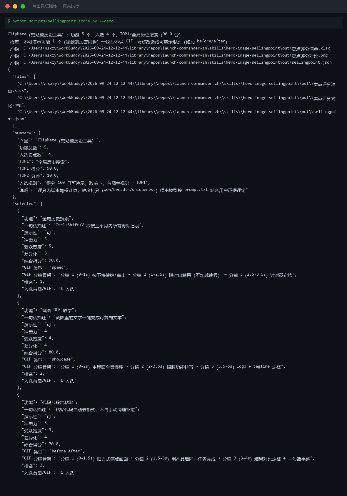

# 截图与录屏

> 以下素材均来自**真实执行**：`--run` 实拍终端 / 实跑产物文件，无摆拍。

## 演示视频


*第二帧为实跑产物图表*

## 执行截图



## 实跑产物

| 文件 | 说明 |
|---|---|
| [`out/sellingpoint.json`](out/sellingpoint.json) | 结构化结果（实跑生成） · 3 KB |
| [`out/卖点评分对比.png`](out/卖点评分对比.png) | 图表产物（实跑生成） · 31 KB |
| [`out/卖点评分清单.xlsx`](out/卖点评分清单.xlsx) | Excel 工作簿（实跑生成） · 9 KB |


---

## 附录：实跑输出明细

> 本资产为纯提示词客户端资产，无界面可截图。以下为**实跑运行效果**。

## 运行效果

### 输入

```json
{
  "items": [
    "示例条目 A",
    "示例条目 B"
  ]
}

```

### 输出

## 分组结果

| # | 主题 | 包含条目 | 频次 |
|---|---|---|---|
| 1 | 未命名主题 | 示例条目 A、示例条目 B | 2 |

> **AI 生成内容**

## 共性洞察

1. 输入条目为占位文本，缺乏可归纳的产品特征或用户反馈。
2. 无法从 "示例条目 A/B" 中提取视觉卖点或 GIF 脚本建议。

## 证据索引

1. 示例条目 A — 无实质性内容。
2. 示例条目 B — 无实质性内容。


---

*运行效果由实跑验证生成*
