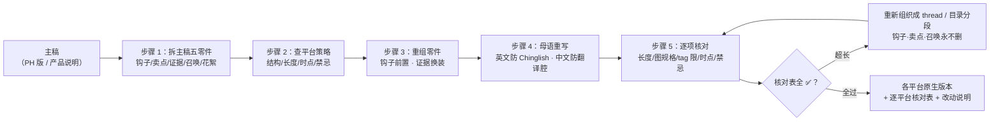

# 平台格式适配 Platform Format Adapt

> 原子技能 ｜ 属于「发布指挥官」 ｜ OPC 客群（独立开发者/出海小团队） ｜ T2 纯提示词型
>
> **把主稿改写成各平台的「原生帖子」——不是删删减减凑字数，而是按每个平台的阅读习惯重新组织。adapted 帖子的标准：看不出是从别处复制来的。**
> 7 个平台硬规格表（字数/图尺寸/时点/结构）· 五步适配法（拆零件→定策略→重组→母语重写→逐项核对）· 各平台特有禁忌清单


🎬 **[▶ 观看高清完整版（mp4）](https://cdn.jsdelivr.net/gh/bangwozuo/launch-commander-zh@main/skills/platform-format-adapt/docs/assets/demo.mp4)** — 四幕创作叙事：业务钩子 → 真实执行 → 要点到成稿演变 → 交付物

*上图来自 `examples/output.md` 实跑产物预览：ClipMate 主稿 → X（thread×2，条 1 共 271 字符）/ V2EX（标题 33 字）/ 即刻（386 字）三平台适配，长度与图规格逐项核对全过。*

---

## 它适配什么（平台硬规格表，逐项核对）

| 平台 | 标题/首行 | 正文长度 | 图 | 发布时点 | 结构要求 |
|---|---|---|---|---|---|
| Product Hunt | tagline ≤60 字符 | 描述 ≤260 字符 | gallery 5 张 1270×760 | 00:01 PT | 首评 30 分钟内跟进 |
| X / Twitter | 首行即钩子 | ≤280 字符（thread 每条同限） | 单图 16:9 或 GIF ≤15s | 9 AM / 8 PM EST 双峰 | 第一条不带链接（降权），链接放回复 |
| Reddit | 标题 ≤300 字符 | 版规各异 | 多数版规禁图 | 工作日 8-10 AM EST | 先读版规；披露 I made this |
| V2EX | ≤40 字上下，不标题党 | 无硬限，分节点 | 正文不放图（或仅一张） | 上午 10 点 | 首段讲清「是什么+为什么做」 |
| 即刻 | 首行钩子 | 建议 ≤500 字 | 1-3 张 3:4 竖图 | 晚 8-10 点 | 带 1-2 个相关圈子话题 |
| 小红书 | 标题 ≤20 字符 | ≤1000 字符 | 3-6 张 3:4 首图带大字 | 晚 8-10 点 | emoji 分段；前 20 字决定展开率 |
| 微博/公众号 | — | 微博 ≤2000；公众号不设限 | 各自规格 | 晚 8-10 点 | 公众号长文须有目录结构 |

各平台特有禁忌（踩过就白干）：X 首条带链接降权、tag ≤2；Reddit 不披露利益相关被识破 = 版封 + 截图挂人；V2EX 标题党被点「不感谢」、发错节点移出首页；小红书导流词（「私」「加V」）限流；即刻纯广告贴没人转发。

## 真实输入 → 真实输出

**输入**（`examples/input.json`）：ClipMate 主稿（PH 版）→ X / V2EX / 即刻 三平台，中文版需开发花絮、X 需 thread。

**输出**（适配总览，实跑）：

| 平台 | 版本状态 | 首行/标题 | 长度核对 | 图核对 | 发布时点 |
|---|---|---|---|---|---|
| X | ✅ 完成（thread×2） | I lost my 7th API key last year. | 条 1：271 字符 ✅ | GIF 16:9 ≤15s ✅ | 9 AM / 8 PM EST 双峰 |
| V2EX | ✅ 完成 | 剪贴板历史工具 ClipMate：本地存储，Ctrl+Shift+V 秒搜三个月记录 | 标题 33 字 ✅ | 不放图 ✅ | 上午 10 点 |
| 即刻 | ✅ 完成 | 做了两年，我的剪贴板工具终于要发了 | 全文 386 字 ✅（≤500） | 3 张 3:4 竖图 ✅ | 晚 8-10 点 |

V2EX 版首段（重写非翻译——V2EX 要「为什么做」的故事）：

> 做这个东西的原因很简单：去年第 7 次弄丢复制过的 API key 之后忍不了了。市面上的
> 剪贴板工具要么太重，要么要把剪贴板传到别人服务器上——我复制的东西凭什么归云端管。

完整输出见 [`examples/output.md`](examples/output.md)（含逐平台核对表与改动说明）。

## 处理流水线



## 快速开始

**提示词方式（3 步）**

```text
1. 打开 prompt.txt，全文复制
2. 粘贴到 Coze / WorkBuddy / Dify / Claude / ChatGPT
3. 按 schema.json 提供：主稿 + 目标平台列表 + 发布日期与特殊要求
```

字数换算纪律：中文 1 字 ≈ 英文 2 字符（X 280 字符 ≈ 中文 130-150 字）；删减顺序：形容词 → 背景 → 次要卖点，钩子、核心卖点、行动召唤三个零件永不删。产出可交 multi-platform-copy-adapt-flow 做机器校验（字数/披露/口径只认脚本统计）。

## 面向谁 / 什么时候用

| ✅ 该用 | ❌ 别用 |
|---|---|
| 主稿已定，要发 3-7 个平台 | 「一稿多发」式复制粘贴（每个平台重组结构，哪怕只有 100 字） |
| 防三类「发完才发现」：X 首条带链接、Reddit 忘披露、字数超限 | 删证据链：主稿的数据/背书被删掉 = 适配稿变空话 |
| 母语重写（英文防 Chinglish、中文防翻译腔） | 虚构平台规格（拿不准就标「需核对官方」，不猜） |

## 边界与合规

- 输出标注「AI 生成内容」，各平台版本人工确认后发布
- 保留主稿事实口径：价格、数字、承诺在各平台版本中一字不差
- 各平台 AI 内容标识按平台现行要求执行（如微博/公众号 AIGC 标注）；不用导流敏感词替代正规链接

## 文件地图

```text
├── README.md       ← 本文件
├── SKILL.md        ← 资产定义（元信息 / 契约 / 边界）
├── prompt.txt      ← 提示词本体（平台规格表 + 五步法 + 禁忌清单）
├── schema.json     ← 输入输出契约（机器可读）
├── examples/       ← 真实输入 + 输出（三平台版本 + 核对表）
└── docs/           ← 9 项配套文档（架构 / 流程 / 场景 / 测试报告…）
```

---

*本资产遵循 [bangwozuo 数字员工资产规范](https://github.com/bangwozuo/digital-employee-spec) v3.0 ｜ [所属员工：发布指挥官](../../) ｜ [总入口](https://github.com/bangwozuo/digital-employees-hub-zh)*
