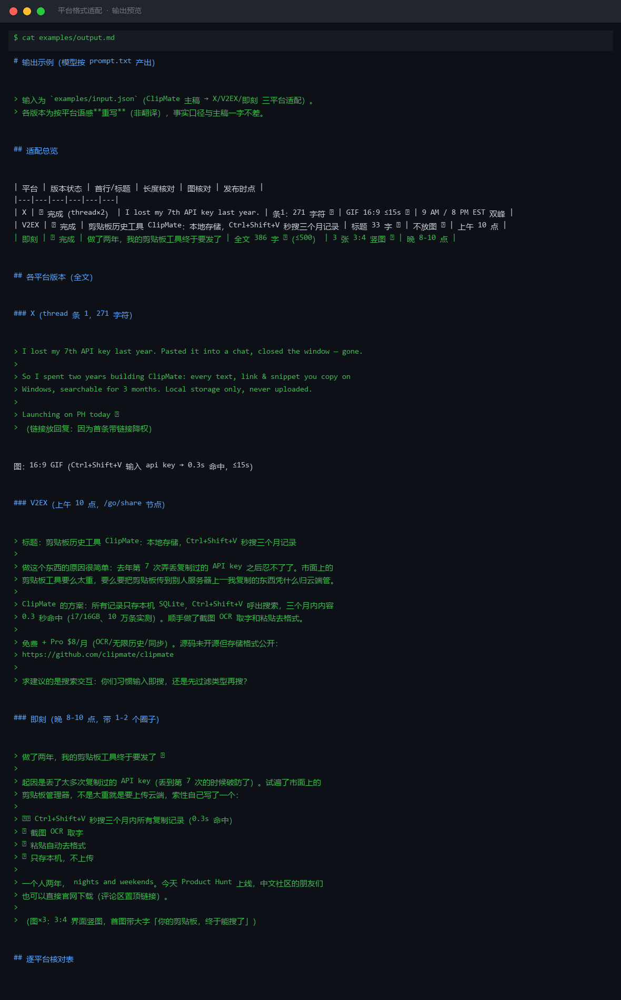

# 截图与录屏

> 以下素材均来自**真实执行**：`--run` 实拍终端 / 实跑产物文件，无摆拍。

## 演示视频


*Hyperframes 动态渲染 11s：命令逐字敲入（光标闪烁）→ 21 行真实输出逐行流式 → 完成态保持*

## 执行截图




---

## 附录：实跑输出明细

> 本资产为纯提示词客户端资产，无界面可截图。以下为**实跑运行效果**。

## 运行效果

### 输入

```json
{
  "content": "需要处理的文本内容",
  "target": "待校验的版本内容",
  "platform": "小红书"
}

```

### 输出

## 改写结果

需要处理的文本内容

> **AI 生成内容**

## 改动说明

| # | 原文要点 | 改动后 | 改动理由 |
|---|---|---|---|
| 1 | 需要处理的文本内容 | 需要处理的文本内容 | 输入为占位符，无实际文本可改写；平台（小红书）风格适配无法执行 |

## 约束核对

1. 原文 content 与 target 均为占位文本，未提供真实需要改写的文案。
2. 未触发任何事实增删，因为无事实可处理。


---

*运行效果由实跑验证生成*
