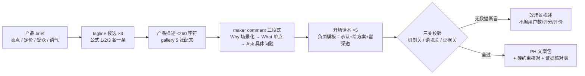

# Product Hunt 文案 Product Hunt Copy

> 原子技能 ｜ 属于「发布指挥官」 ｜ OPC 客群（独立开发者/出海小团队） ｜ T2 纯提示词型
>
> **产出一整套 PH 发布文案包：tagline、产品描述、gallery 配文、maker comment、评论区开场话术。PH 用户一天刷过 30 个产品，文案的唯一任务：5 秒内让人决定点「访网站」。**
> 6 项 PH 机制硬约束 · tagline 4 个结构公式 + 3 类禁用模式 · maker comment 三段式（150-250 词）· 证据纪律（不编数据）


🎬 **[▶ 观看高清完整版（mp4）](https://cdn.jsdelivr.net/gh/bangwozuo/launch-commander-zh@main/skills/producthunt-copy/docs/assets/demo.mp4)** — 四幕流转叙事：业务钩子 → 真实执行 → 数据管线节点动画 → 交付物

*上图来自 `examples/output.md` 实跑产物预览：ClipMate 文案包——tagline 38 字符（≤60）✅、产品描述 193 字符（≤260）✅、maker comment 217 词（150-250）✅、gallery 5 张配文 + tagline 候选 3 条。*

---

## 它服从什么（PH 机制硬约束）

| 项 | 约束 | 原因 |
|---|---|---|
| tagline | **≤60 字符**（含空格），不带句号 | 列表页截断超过部分；句号在列表页显得拖沓 |
| gallery | 5 张，1270×760 | 第 1 张主视觉+tagline，2-3 张演示 GIF 静帧，第 4 张背书，第 5 张价格/路线图 |
| 发布时点 | **00:01 PT** | 抢当日榜，吃满美国白天 + 榜单马太效应 |
| maker comment | 发布后 **30 分钟内**发出 | 首评讲「为什么做这个」，是转化率第二高的触点 |
| 评论响应 | 首日评论 **30 分钟内**回复 | 评论速度与质量进排名算法 |
| 投票红线 | 不买票、不互换票、不给投票奖励 | PH 明令禁止 incentivized upvote，被抓直接下架 |

### tagline 写法（60 字符内的三次机会）

| 公式 | 例 | 优先级 |
|---|---|---|
| 动词开头 + 结果 | `Ship docs 10x faster` | 1（比 "A tool for..." 强 10 倍） |
| 痛点否定 | `Your clipboard, finally searchable` | 2 |
| 具体数字 | `Turn 3h of editing into 5 min` | 3 |
| 身份定位 | `Notion-style docs for local-first freaks` | 4 |

禁用模式：❌ `A/AI-powered/an innovative ...` 开头（模板句，访客直接跳过）；❌ 堆形容词（`fast, simple, powerful` 三个词说了等于没说）；❌ 说「是什么」不说「改变什么」。

## 真实输入 → 真实输出

**输入**（`examples/input.json`）：ClipMate 文案包需求（卖点/定价/受众/语气约束）。

**输出**（文案包总览，实跑）：

| 件 | 内容 | 硬约束核对 |
|---|---|---|
| tagline | Your clipboard, finally searchable. | 38 字符 ✅（≤60） |
| 产品描述 | ClipMate keeps every text, link, and snippet you copy on Windows — searchable for the last 3 months, stored locally, never uploaded. | 193 字符 ✅（≤260） |
| gallery 配文 | 5 张逐张（主视觉/搜索 GIF/OCR GIF/背书/定价） | 1270×760 ✅ |
| maker comment | Why→What→Ask 三段式 | 217 词 ✅（150-250） |
| 开场话术 ×5 | 覆盖祝贺/定价/平台/竞品/路线图问法 | 2-3 句/条 ✅ |

maker comment 开头（Why 段——具体到场景才可信）：

> Hey hunters! Two years ago I lost the 7th API key I'd ever copied — pasted it into a
> chat, closed the window, gone. I tried every clipboard manager on Windows and bounced
> off all of them: too heavy, too cluttered, or they wanted to upload my clipboard to
> their cloud.

tagline 候选 3 条（公式 1/2/3 各一条）供盲选；完整输出见 [`examples/output.md`](examples/output.md)（含证据核对表与发布前自查）。

## 处理流水线



## 快速开始

**提示词方式（3 步）**

```text
1. 打开 prompt.txt，全文复制
2. 粘贴到 Coze / WorkBuddy / Dify / Claude / ChatGPT
3. 按 schema.json 提供：产品 brief + 关键卖点 + 语气与硬约束
```

发布后第 4 小时可改 tagline（排名波动期后），保留数据做 T+7 归因。语言自查：没有 very、没有 more and more、没有中文直译结构、产品名不翻译、缩写自然（it's / we're / don't）。

## 面向谁 / 什么时候用

| ✅ 该用 | ❌ 别用 |
|---|---|
| PH 发布前（T-7 至 T-3）的整套文案包 | 编造用户数、评分、评价（无数据的卖点改用场景描述） |
| tagline 三条候选盲选 + 发布后数据归因 | 写 incentivized 投票话术（投票换福利 = PH 明令禁止的下架行为） |
| maker comment 的 Why/What/Ask 三段式 | 攻击竞品（「比 X 好用」→ 改为差异描述）；AI 味浓词（game-changing / revolutionary / seamless） |

## 边界与合规

- 输出标注「AI 生成内容」，全部文案人工确认后才上传 PH
- 文案与实际产品功能一致，不承诺路线图外功能
- 遵守 PH Guidelines（不做 incentivized voting、不假冒用户评论）；用户评价引用须获授权；性能对比只用自己实测数据并标注测试环境

## 文件地图

```text
├── README.md       ← 本文件
├── SKILL.md        ← 资产定义（元信息 / 契约 / 边界）
├── prompt.txt      ← 提示词本体（PH 机制 + tagline 公式 + 三段式 + 证据纪律）
├── schema.json     ← 输入输出契约（机器可读）
├── examples/       ← 真实输入 + 输出（文案包 + 候选 + 自查）
└── docs/           ← 9 项配套文档（架构 / 流程 / 场景 / 测试报告…）
```

---

*本资产遵循 [bangwozuo 数字员工资产规范](https://github.com/bangwozuo/digital-employee-spec) v3.0 ｜ [所属员工：发布指挥官](../../) ｜ [总入口](https://github.com/bangwozuo/digital-employees-hub-zh)*
