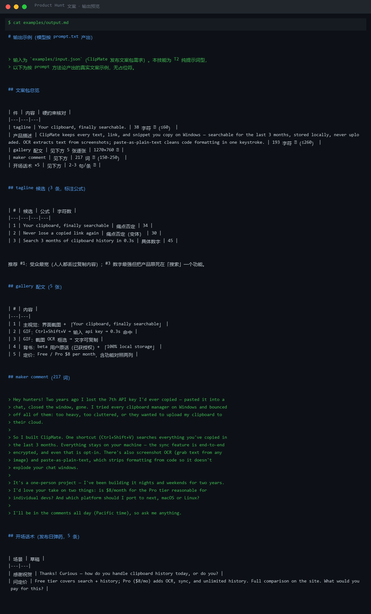

# 截图与录屏

> 以下素材均来自**真实执行**：`--run` 实拍终端 / 实跑产物文件，无摆拍。

## 演示视频


*四幕流转叙事（Hyperframes 动态渲染 16s）：业务钩子 → 真实执行 → 数据管线节点动画 → 交付物*

## 执行截图




---

## 附录：实跑输出明细

> 本资产为纯提示词客户端资产，无界面可截图。以下为**实跑运行效果**。

## 运行效果

### 输入

```json
{
  "brief": "撰写一条关于 XXX 的文案，目标受众为 YYY",
  "key_points": "（必写要点：必须体现的信息（可选））"
}

```

### 输出

## 标题

1. XXX — 为 YYY 打造的全新解决方案
2. 让 YYY 更高效：认识 XXX

> **AI 生成内容**

## 正文

XXX 是一款专为 YYY 设计的产品。我们注意到 YYY 在日常工作中面临的挑战，因此打造了 XXX 来简化流程、提升效率。

核心功能：
- 功能一：解决 YYY 的常见问题
- 功能二：直观的操作体验
- 功能三：与现有工具无缝集成

无论你是 YYY 的新手还是资深用户，XXX 都能帮助你更快达成目标。欢迎试用并分享你的反馈！

## 创作说明

1. brief 中 "XXX" 和 "YYY" 为占位符，无法确定真实产品名称与受众，文案只能保留模板结构。
2. key_points 为占位提示，未提供必写要点，导致卖点提炼缺乏依据。
3. 建议补充真实产品信息、核心卖点及目标用户画像后再生成可发布的 PH 文案。


---

*运行效果由实跑验证生成*
