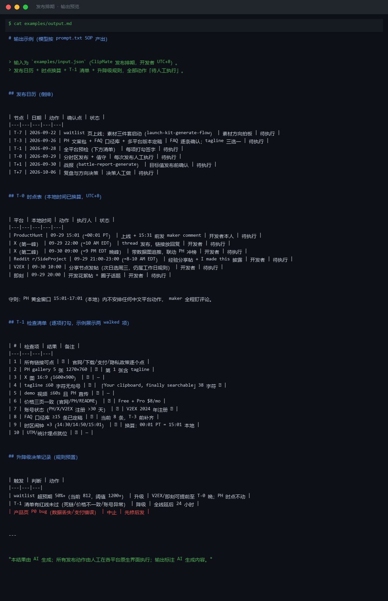
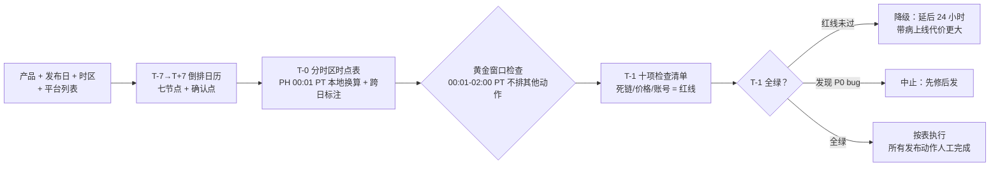

# 发布排期 Publish Schedule

> 原子技能 ｜ 属于「发布指挥官」 ｜ OPC 客群（独立开发者/出海小团队） ｜ T4 SOP 型
>
> **不写文案、不做素材——把「发布日到底几点干什么」用倒排时间轴钉死，配上每个节点的人工确认点和检查清单，让发布日不再靠记忆和运气。**
> T-7→T+7 七节点倒排时间轴 · T-1 十项检查清单（3 项红线）· T-0 六平台分时区时点表 · 升降级/中止规则预置



*上图来自 `examples/output.md` 实跑产物预览：ClipMate 发布排期（开发者 UTC+8）——倒排日历 T-7 至 T+7 六节点、T-0 时点表（00:01 PT = 本地 15:01，闹钟 ×3：14:30/14:50/15:01）、T-1 十项清单与升降级规则。*

---

## 它排什么（倒排时间轴，T = 发布日）

| 节点 | 时间 | 关键动作 | 人工确认点 |
|---|---|---|---|
| **T-7** | 预热启动 | waitlist 页/预告帖上线；素材三件套启动 | 素材方向拍板 |
| **T-3** | 素材定稿 | PH 文案包定稿；FAQ 口径库定稿（≥15 条）；多平台版本产出 | FAQ 口径逐条确认；tagline 三选一 |
| **T-1** | 全平台预检 | 十项检查清单逐项过；账号状态确认 | 每项打勾人签字 |
| **T-0** | 发布日 | 分时区发布 + 评论值守（每 15 分钟） | 每次发布动作人工执行 |
| **T+1** | 战报 | 五指标达标判定 + 归因 | 目标值确认（发布前就该定） |
| **T+7** | 复盘 | 留存数据 + waitlist 转化复盘；决定乘胜/止损 | 方向决策人工做 |

### T-0 分时区发布时点表（各平台经验值）

| 平台 | 时点 | 备注 |
|---|---|---|
| Product Hunt | **00:01 PT** | 抢当日榜；发布后 30 分钟内发 maker comment |
| X / Twitter | 9 AM EST + 8 PM EST（双峰） | 首条不带链接（链接放回复）；晚间峰联动 PH 冲榜 |
| Reddit | 工作日 8-10 AM EST | 版规先读；I made this 必须披露 |
| V2EX | 上午 10 点（北京时间） | 进首页 4-6 小时有效；下午发 = 白发 |
| 即刻/小红书/微博 | 晚 8-10 点（北京时间） | 中文社区晚高峰 |

时点冲突处理：T-0 当天 **PH 优先**——所有中文平台动作不得占用 00:01-02:00 PT 的 PH 黄金响应窗口。

## 真实输入 → 真实输出

**输入**（`examples/input.json`）：ClipMate 发布日 2026-09-29（周二）、开发者 UTC+8、五平台、waitlist 812。

**输出**（T-0 时点表节选，已换算本地时间）：

| 平台 | 本地时间 | 动作 | 备注 |
|---|---|---|---|
| ProductHunt | 09-29 15:01（=00:01 PT） | 上线 + 15:31 前发 maker comment | 闹钟 ×3 |
| X（第一峰） | 09-29 22:00（=10 AM EDT） | thread 发布，链接放回复 | — |
| Reddit r/SideProject | 09-29 21:00-23:00（=8-10 AM EDT） | 经验分享帖 + I made this 披露 | — |
| V2EX | 09-30 10:00 | 分享节点发帖 | 次日选周三，仍属工作日规则 |
| 即刻 | 09-29 20:00 | 开发花絮帖 + 圈子话题 | — |

T-1 检查清单十项（第 1/6/7 项为红线：链接死链、价格三页不一致、账号异常）；升降级规则预置——waitlist 812 时升级阈值 1200+（超预期 50%+），红线未过全线延后 24 小时。

完整输出见 [`examples/output.md`](examples/output.md)。

## 处理流水线



## 快速开始

**提示词方式（3 步）**

```text
1. 打开 prompt.txt，全文复制
2. 粘贴到 Coze / WorkBuddy / Dify / Claude / ChatGPT
3. 按 schema.json 提供：产品 + 发布日 + 本地时区 + 平台列表
```

边界：本 SOP 不自动发布——连接器（若有）仅用于只读日历订阅提醒；所有发布动作由人工在各平台原生界面执行；连接器失效时打印时点表人工按表执行（无外部依赖也必须能跑）。可交 publish-calendar-flow 脚本化生成本地换算日历与 PNG 时间轴。

## 面向谁 / 什么时候用

| ✅ 该用 | ❌ 别用 |
|---|---|
| T-7 就把发布周钉进日历（时区算错/忘设闹钟归零） | 自动发布、代点「发布」按钮（所有对外动作人工执行） |
| T-1 预检拦住死链/价格打架/新号 spam | T-1 清单未全绿时「先发再说」（带病上线 = 信任事故） |
| PH 黄金窗口与中文平台晚高峰错峰安排 | incentivized 手段凑首发势能（互赞群/投票互换） |

## 边界与合规

- 所有对外发布动作保留人工确认与执行；确认点不许「批处理」（T-3 FAQ 口径逐条确认，不能默认通过）
- 遵守各平台发布规则（PH 无 incentivized voting、Reddit 披露利益相关、微博/公众号 AIGC 标识按现行要求）
- waitlist 邮件须含退订链接（发送前人工抽查一封）

## 文件地图

```text
├── README.md       ← 本文件
├── SKILL.md        ← 资产定义（元信息 / 契约 / 边界）
├── prompt.txt      ← 提示词本体（倒排时间轴 + T-1 清单 + 时点表 + 升降级规则）
├── schema.json     ← 输入输出契约（机器可读）
├── examples/       ← 真实输入 + 输出（日历 + 本地换算时点表 + 清单）
└── docs/           ← 9 项配套文档（架构 / 流程 / 场景 / 测试报告…）
```

---

*本资产遵循 [bangwozuo 数字员工资产规范](https://github.com/bangwozuo/digital-employee-spec) v3.0 ｜ [所属员工：发布指挥官](../../) ｜ [总入口](https://github.com/bangwozuo/digital-employees-hub-zh)*
