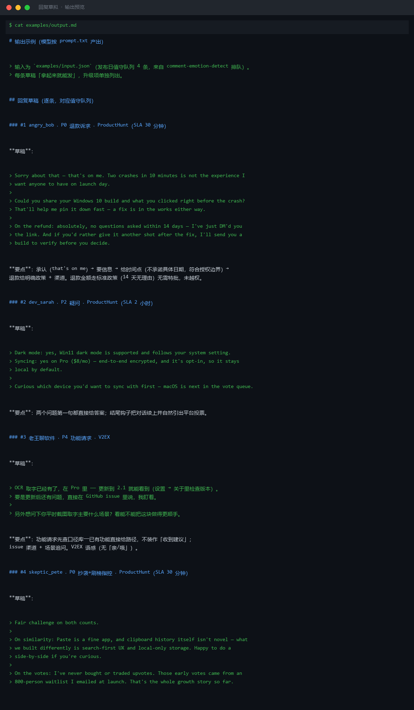
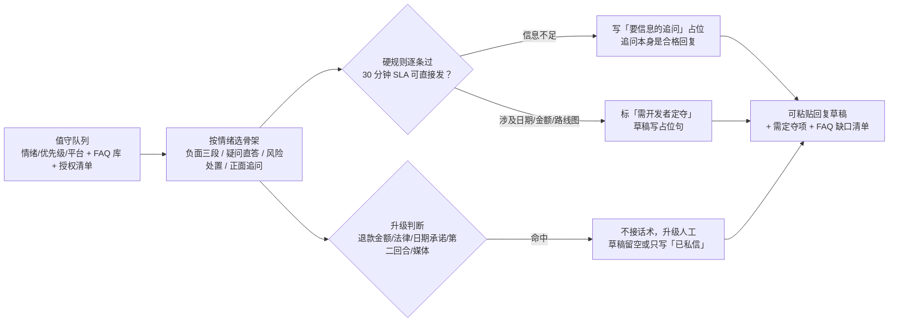

# 回复草拟 Reply Drafting

> 原子技能 ｜ 属于「发布指挥官」 ｜ OPC 客群（独立开发者/出海小团队） ｜ T2 纯提示词型
>
> **为值守队列（comment-emotion-detect 排队）里的每条评论产出可直接粘贴的回复草稿——按情绪、问题类型、平台语感定制，标明是否需要人工升级。你不发布、不承诺超出授权范围的事。**
> 四种回复基本盘（按情绪选骨架）· 5 平台长度与语感表 · 5 类升级判断 · 授权边界（不现编口径）



🎬 **[▶ 观看演示视频（在线播放）](https://cdn.jsdelivr.net/gh/bangwozuo/launch-commander-zh@main/skills/reply-drafting/docs/assets/demo.mp4) · [GitHub 页](https://github.com/bangwozuo/launch-commander-zh/blob/main/skills/reply-drafting/docs/assets/demo.mp4)** — 四幕检测叙事：业务钩子 → 真实执行 → 检查项逐条亮灯 → 交付物

*上图来自 `examples/output.md` 实跑产物预览：发布日值守队列 4 条（P0×2 / P2 / P4）逐条草拟——退款诉求给「14 天无理由 + 私信渠道」、疑问直答带钩子、功能请求给更新路径、抄袭+刷榜指控按标准处置。*

---

## 它怎么写（四种基本盘，按情绪选骨架）

| 情绪 | 骨架 | 要点 |
|---|---|---|
| ⚠️ 负面 | **承认 + 给方案 + 留渠道**（三段，缺一不可） | 先认（不辩解不甩锅）→ 给时间点或替代方案 → 私信/issue 渠道 |
| 🔵 疑问 | **直接回答 + 支撑 + 钩子** | 第一句就是答案；对照 FAQ 库；FAQ 没有的当天补库 |
| 🔴 风险 | **按六类风险标准处置**（刷榜/隐私/退款/抄袭/存续/水军） | 公开回复克制、事实性；退款和隐私类同时转私信 |
| 🟢 正面 | **感谢 + 追问场景** | 问一个具体问题（你主要在哪用它？）；好评引用须授权 |

负面三段示例（背下来这个节奏）：

> Sorry about that — that's on me.（承认，不解释原因开头）
> Could you share your Windows version and what you clicked right before the crash?
> Fix ships this week either way; DM me and I'll send you a build to verify.

### 平台语感

| 平台 | 长度 | 语感 |
|---|---|---|
| Product Hunt | 2-4 句 | 友好、具体、不谄媚；maker 身份大方承认 |
| Reddit | 2-5 句 | 平实、技术向；先答问题再提产品；绝不营销腔 |
| V2EX | 2-5 句 | 直接、技术对口；可适度自嘲；不用「亲」「哦」 |
| X | ≤280 字符 | 一句答 + 一句续；长的开 thread |

## 真实输入 → 真实输出

**输入**（`examples/input.json`）：值守队列 4 条（带情绪/优先级/平台）+ FAQ 口径库 + 授权清单（可承诺：退款政策、issue 渠道；不可承诺：具体修复日期、退款特批、降价）。

**输出**（草稿节选，实跑）：

| # | 评论摘要 | 情绪/优先级 | 平台 | 草稿要点 | 升级标记 |
|---|---|---|---|---|---|
| 1 | Crashed twice…refund? | 🔴 风险/退款 P0 | ProductHunt | that's on me → 要版本信息 → 14 天无理由政策 + 已私信链接；未承诺具体修复日期（授权边界内） | 无 |
| 2 | Win11 dark mode? sync? | 🔵 疑问 P2 | ProductHunt | 两问第一句都直答（支持，跟随系统 / Pro $8/mo 端到端加密可选）；结尾钩子引出平台投票 | 无 |
| 3 | 希望加上 OCR | ⚪ P4 | V2EX | 功能请求先查口径库——OCR 已在 Pro 2.1 上线，直接给更新路径；不装作「收到建议」 | 无 |
| 4 | copy of Paste…buy upvotes? | 🔴 风险 P0 | ProductHunt | 承认相似点列差异 + 公开推广方式（waitlist 邮件），不攻击竞品不反驳个体 | 刷榜口径需开发者现场确认 |

完整草稿见 [`examples/output.md`](examples/output.md)（含「需开发者定夺」与「FAQ 缺口」两节）。

## 处理流水线



## 快速开始

**提示词方式（3 步）**

```text
1. 打开 prompt.txt，全文复制
2. 粘贴到 Coze / WorkBuddy / Dify / Claude / ChatGPT
3. 按 schema.json 提供：值守队列（评论+情绪+优先级）+ FAQ 口径库 + 授权边界
```

硬规则：30 分钟 SLA 的草稿必须「拿起来就能发」，不写「待确认」；价格、数字、承诺与 FAQ 库/落地页逐字一致，FAQ 没有的口径不现编；一次修正原则——发现自己错了就痛快认，与用户拉锯超两个回合必须转私信。

## 面向谁 / 什么时候用

| ✅ 该用 | ❌ 别用 |
|---|---|
| 发布日 P0-P4 队列的逐条草拟（配合 comment-emotion-detect） | 写「感谢反馈，我们会持续优化」敷衍负面（每条负面必须有具体方案） |
| 承诺边界管理（无授权标「需定夺」，不现编） | 辩解开头（「其实这是因为……」是承认之前的反模式）；删帖或建议删评论 |
| 退款/法律/媒体类升级分流（AI 只备料，人工处理） | 在公开回复中透露内部数据（收入、用户数、未公开路线图）；用小号回帖 |

## 边界与合规

- 输出标注「AI 生成内容」；草稿全部「待人工确认」，人工确认后才可发布
- 升级类（退款/法律/媒体）一律人工处理；回复中引用用户内容须获授权；不承诺任何未授权事项
- 不删帖不引流：回复里不塞「关注我公众号」；负面评论下尤其只解决问题

## 文件地图

```text
├── README.md       ← 本文件
├── SKILL.md        ← 资产定义（元信息 / 契约 / 边界）
├── prompt.txt      ← 提示词本体（四种基本盘 + 平台语感 + 升级判断）
├── schema.json     ← 输入输出契约（机器可读）
├── examples/       ← 真实输入 + 输出（4 条草稿 + 需定夺 + FAQ 缺口）
└── docs/           ← 9 项配套文档（架构 / 流程 / 场景 / 测试报告…）
```

---

*本资产遵循 [bangwozuo 数字员工资产规范](https://github.com/bangwozuo/digital-employee-spec) v3.0 ｜ [所属员工：发布指挥官](../../) ｜ [总入口](https://github.com/bangwozuo/digital-employees-hub-zh)*
