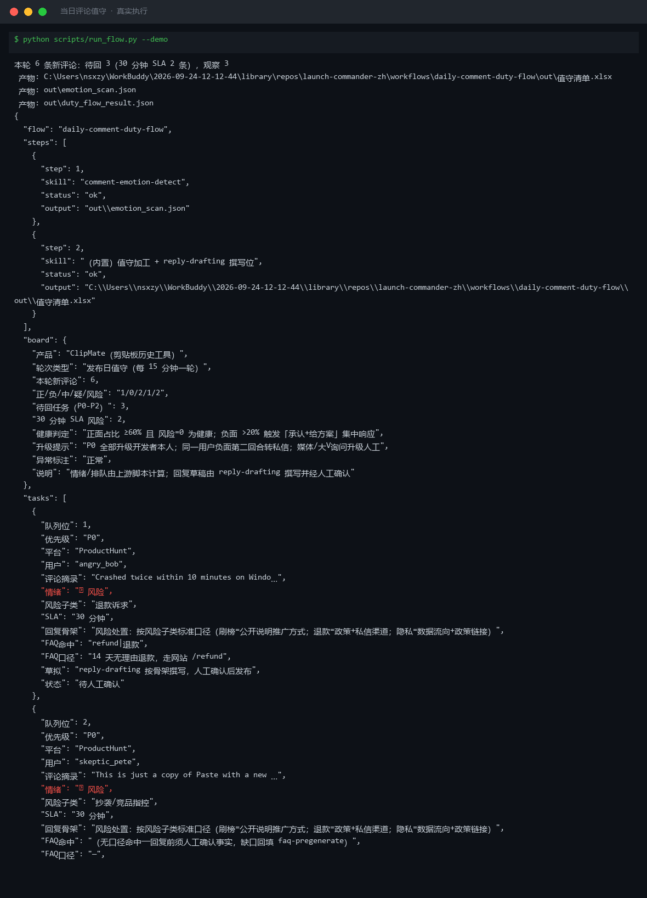
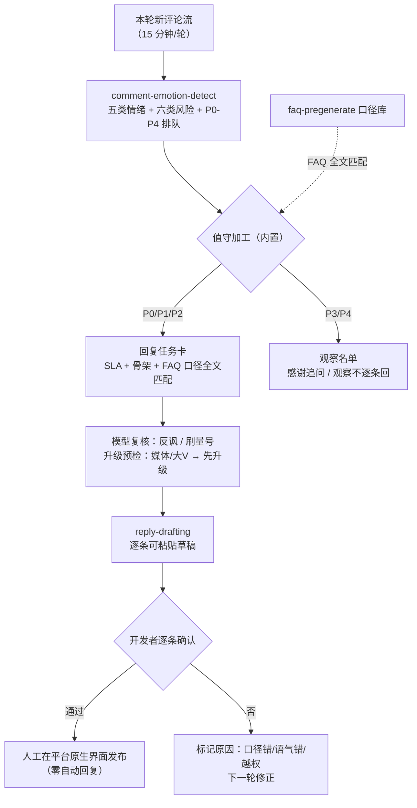

# 当日评论值守 Daily Comment Duty Flow

> 工作流（复合技能） ｜ 属于「发布指挥官」 ｜ OPC 客群（独立开发者/出海小团队） ｜ T3 编排型
>
> **发布日每 15 分钟一轮的评论区巡逻，自动化到只剩人肉决策：上游分类排队，本流程把队列转换成回复任务卡（带 SLA、回复骨架、FAQ 口径），开发者只做两件事：确认草稿、点发送。**
> 触发：定时（发布日每 15 分钟，日常期每小时）· 省 4h 盯屏 ≈ ¥320/次 · P0 风险 30 分钟内升级 · 零自动回复



*上图来自真实执行：`python scripts/run_flow.py --demo` 退出码 0。发布日一轮 6 条新评论（PH/V2EX/即刻）——待回任务 3 条（30 分钟 SLA 风险 2 条）、观察 3 条；退款诉求命中 FAQ 口径「14 天无理由」，抄袭+刷榜指控无命中标「回复前须人工确认事实」。*

---

## 它做什么（三步编排）

| 步骤 | 执行位 | 处理 | 产出 |
|---|---|---|---|
| 1. 情绪识别与排队 | `comment-emotion-detect`（脚本） | 五类情绪 + 六类风险子类 → P0-P4 排队（SLA：P0 30 分钟 / P1 PH 首日 30 分钟其余 60 分钟 / P2 2 小时 / P3 24 小时 / P4 48 小时） | emotion_scan.json + 评论分类清单.xlsx + 情绪分布.png |
| 2. 值守加工（内置） | 脚本 | P0/P1/P2 → 回复任务卡（贴 SLA + 回复骨架 + 按评论**原文全文**匹配 FAQ 口径）；P3/P4 → 观察名单。任务卡不写具体文案——那是 reply-drafting 的活 | 值守清单.xlsx（任务卡+观察名单+看板）+ duty_flow_result.json |
| 3. 草拟与人工确认 | `reply-drafting` → 人工 | 逐条写可粘贴草稿 → 开发者确认 → 人工在平台原生界面发布。升级项（退款金额/法律/媒体/第二回合）不写草稿直接升级 | 回复草稿（全部待人工确认） |

### 量化规则（判定不看感觉）

- 轮询频率：发布日 **15 分钟/轮**；T+1 起每小时；T+3 起每天两轮
- 健康线：正面占比 ≥60% 且风险=0；负面 >20% → 当天置顶澄清集中响应；疑问 >30% → 当天补 FAQ
- 队列纪律：P0+P1 积压 **>8 条未回** → 冻结新内容发布，先清队列
- FAQ 命中口径：按评论**原文全文**匹配（40 字摘录会截断关键词——这是踩过的坑）

## 真实输入 → 真实输出

**输入**（`examples/input.json`）：发布日一轮 6 条评论 + FAQ 口径库 5 条（dark mode / sync / refund / privacy / 价格）。

**输出**（回复任务卡节选，脚本实跑）：

| 队列位 | 优先级 | 平台 | 用户 | 摘录 | SLA | 回复骨架 | FAQ 口径 |
|---|---|---|---|---|---|---|---|
| 1 | P0 | ProductHunt | angry_bob | Crashed twice within 10 minutes… | 30 分钟 | 风险处置：退款=政策+私信渠道 | 14 天无理由退款，走网站 /refund |
| 2 | P0 | ProductHunt | skeptic_pete | This is just a copy of Paste… | 30 分钟 | 风险处置：抄袭=承认相似+差异表 | （无命中）回复前须人工确认事实 |
| 3 | P2 | ProductHunt | dev_sarah | Does it support Windows 11 dark mode?… | 2 小时 | 疑问直答：第一句就是答案 | 支持 Win11 深色模式，自动跟随系统 |

观察名单：好评（感谢+追问场景，引用须授权）、功能请求（观察不逐条回）、mark（观察）。衔接说明：任务卡 1/2/3 → reply-drafting 撰写草稿 → 人工确认 → 人工发布；skeptic_pete 无命中 → 说明推广方式的口径需开发者现场确认后回填 faq-pregenerate。

完整输出见 [`examples/output.md`](examples/output.md)；实跑产物：`out/值守清单.xlsx`（P0 行标红）+ `out/duty_flow_result.json`。

## 处理流水线（DAG 节点 = 本仓真实 slug）



## 快速开始

**方式一：脚本（编排层，零 AI 依赖）**

```bash
pip install openpyxl matplotlib
python scripts/run_flow.py --demo                # 内置真实样例
python scripts/run_flow.py --input examples/input.json --outdir out
```

**方式二：提示词（任意 AI 工具）**

```text
1. 打开 prompt.txt，全文复制
2. 粘贴到 Coze / WorkBuddy / Dify / Claude / ChatGPT
3. 喂入本轮评论流 + FAQ 口径库；模型做反讽/刷量号复核，草稿走 reply-drafting
```

失败模式防线：看板出现「全部中性」即标红「疑似抓取不全」；任务卡只贴口径原文，草拟时不许改数字（防口径漂移）；任务卡含粉丝量/媒体标识字段的一律先升级再草拟。

## 面向谁 / 什么时候用

| ✅ 该用 | ❌ 别用 |
|---|---|
| 发布日高频评论巡逻（响应速度进 PH 排名算法） | 自动回复任何评论（草稿全部人工确认后人工发出） |
| P0 风险 30 分钟内升级（盯漏一条刷榜指控代价远超流程成本） | 删评论、用小号、与用户争论价格 |
| 积压 >8 条先清队列再发新内容 | 用 40 字摘录匹配 FAQ（截断关键词，按原文全文匹配） |

## 边界与合规

- 输出标注「AI 生成内容」；任务卡与看板「待人工确认」后才产生任何动作
- 不自动回复、不删评论、不用小号；回复草稿全部经人工确认后在平台原生界面发出
- 评论内容属用户数据：值守清单仅限发布值守使用，不外发；好评引用须获授权

## 文件地图

```text
├── README.md                ← 本文件
├── SKILL.md                 ← 资产定义（元信息 / 契约 / 边界）
├── prompt.txt               ← 提示词本体（三步编排 + 量化规则 + 失败模式）
├── schema.json              ← 输入输出契约（机器可读）
├── scripts/run_flow.py      ← 编排脚本（调 emotion_scan.py + 值守加工）
├── examples/                ← 真实输入 + 脚本实跑输出
├── docs/                    ← 9 项配套文档（架构 / 流程 / 场景 / 测试报告…）
└── out/                     ← 实跑产物（值守清单.xlsx / duty_flow_result.json）
```

---

*本资产遵循 [bangwozuo 数字员工资产规范](https://github.com/bangwozuo/digital-employee-spec) v3.0 ｜ [所属员工：发布指挥官](../../) ｜ [总入口](https://github.com/bangwozuo/digital-employees-hub-zh)*
