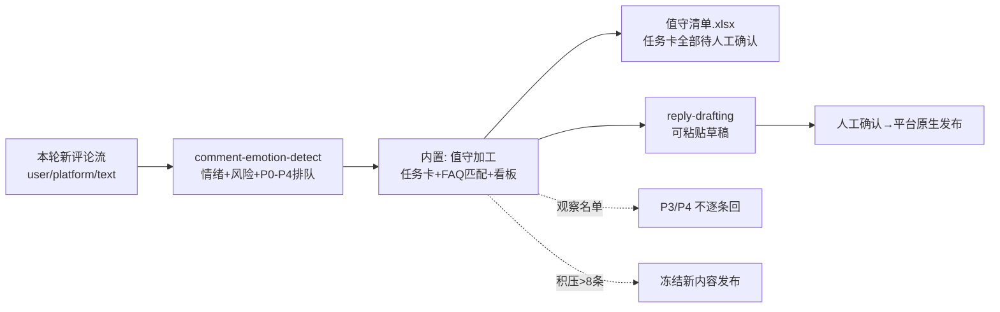

# 当日评论值守流程

把「15 分钟一轮的评论区巡逻」自动化到只剩人肉决策：上游排队、本流程加工成
回复任务卡，开发者只做两件事——确认草稿、点发送。**没有任何评论被自动回复**。

## 元信息

| 字段 | 值 |
|------|-----|
| ID | `de_dev_02_wf04` |
| 类型 | **`composite`（复合技能/工作流）** |
| 所属员工 | 发布指挥官 |
| 阶段 | `P1` |
| 复杂度 | `M` |
| 触发方式 | 定时（发布日每 15 分钟；T+1 每小时；T+3 每天两轮） |
| ROI | 省发布日 4h 盯屏 ≈ ¥320/次 |
| 资产形态 | 可跑编排脚本 + 深度流程提示词（无模型调用依赖、无 API Key） |

## 编排的原子技能

| # | 原子技能 | 能力 |
|---|---------|------|
| 1 | [评论情绪识别](../../skills/comment-emotion-detect/) | 五类情绪+六类风险+P0-P4 排队（scripts/emotion_scan.py） |
| 2 | [回复草拟](../../skills/reply-drafting/) | 按任务卡骨架撰写可粘贴草稿（草拟位） |

## 步骤链路（DAG）



## 步骤明细

| # | 步骤 | 技能资产 | 输入 | 输出 | 失败处理 |
|---|------|---------|------|------|---------|
| 1 | 情绪识别排队 | `comment-emotion-detect` | 评论流（全文） | emotion_scan.json + 分类清单 | 退出码≠0 中止；空流标「发布日 0 评论查链接」 |
| 2 | 值守加工 | 本流程（内置） | scan 结果 + FAQ 库 | 任务卡（SLA/骨架/口径）+ 看板 | FAQ 缺失标「须人工确认事实」；全部中性标红「疑似抓取不全」 |
| 3 | 草拟与确认 | `reply-drafting` + 人工 | 任务卡 | 可粘贴草稿 → 人工发布 | 升级项不写草稿直接升级；积压 >8 条冻结新内容 |

## 输入规格

| 字段 | 类型 | 必填 | 说明 |
|------|------|------|------|
| `comments` | array | ✅ | 本轮新评论（text 须**全文**供 FAQ 匹配） |
| `launch_day` | boolean | ⬜ | 发布日（P1 SLA 30 分钟） |
| `faq` | object | ⬜ | 口径库（关键词→口径），faq-pregenerate 定稿 |
| `product` | string | ⬜ | 产品名 |

## 输出规格

| 字段 | 类型 | 说明 |
|------|------|------|
| `board` | object | 值守看板（分布/待回/SLA 风险/健康判定/异常标注） |
| `tasks` | array | 回复任务卡（P0-P2，含骨架与 FAQ 口径） |
| `watchlist` | array | 观察名单（P3/P4） |
| `deliverable` | file | `out/值守清单.xlsx`（任务卡 P0 标红） |

## 错误处理

| 情况 | 处理方式 |
|------|---------|
| 上游脚本退出码 ≠0 / 产物缺失 | 中止并打印 stderr |
| 评论流为空 | 正常退出，标注「发布日 0 评论——检查发布链接与平台审核状态」 |
| 全部中性 | 标红「疑似抓取不全，人工核对平台评论数」 |
| FAQ 库缺失 | 任务卡照常生成，备注「回复前须人工确认事实」 |
| P0+P1 积压 >8 条 | 冻结新内容发布，先清队列 |

## 使用步骤

### 方式一：跑脚本（端到端）

```bash
python3 <FLOW_DIR>/scripts/run_flow.py --input input.json --outdir out
python3 <FLOW_DIR>/scripts/run_flow.py --demo
```

### 方式二：手动编排（任意 AI 平台）

1. 用 comment-emotion-detect 的 prompt 给本轮评论排队
2. 按 P0-P2 生成任务卡（贴 SLA/骨架/FAQ 口径），P3/P4 进观察名单
3. reply-drafting 写草稿 → 逐条人工确认 → 平台原生界面发布

## 验收标准

- [x] DAG 节点为本仓真实技能 slug（comment-emotion-detect / reply-drafting）
- [x] 任务卡逐条对齐排队结果与 FAQ 口径（按原文全文匹配）
- [x] 全流程人工确认点齐备，回复零自动化
- [x] 失败处理可演练（空流/抓取不全/FAQ 缺失/积压冻结）

## 边界（不做的事）

- ❌ 不自动回复、不删评论、不用小号——发布动作零自动化
- ❌ 不在任务卡里写具体文案（reply-drafting 的活），只给骨架+口径+SLA
- ❌ 不在草稿中改 FAQ 口径的数字（口径漂移=信任事故）
- ❌ 值守清单不外发（评论内容属用户数据）

## 调用示例

**输入**（`examples/input.json`，节选）：

```json
{
  "launch_day": true,
  "product": "ClipMate（剪贴板历史工具）",
  "comments": [
    {"user": "angry_bob", "platform": "ProductHunt", "text": "Crashed twice within 10 minutes. How do I get a refund?"},
    {"user": "dev_sarah", "platform": "ProductHunt", "text": "Does it support Windows 11 dark mode?"}
  ],
  "faq": {"refund|退款": "14 天无理由退款，走网站 /refund"}
}
```

**输出**（run_flow.py 实跑，退出码 0）：6 条评论 → 待回 3（30 分钟 SLA 风险 2 条）、
观察 3；angry_bob 命中退款口径、dev_sarah 命中深色模式口径；skeptic_pete 无命中
标「须人工确认事实」。详见 examples/output.md。

## 所属工作流

本资产为复合技能（工作流）：上游衔接 `publish-calendar-flow`（T-0 启动值守），
T+1 数据交接 `launch-battle-review-flow`。

## 合规声明

- 输出标注「AI 生成内容」；任务卡/草稿全部「待人工确认」后人工发布
- 评论内容属用户数据：值守清单仅限值守使用，不外发；好评引用须获授权
- 不执行任何自动触达；升级类（退款金额/法律/媒体）人工处理

---

*本技能遵循 [bangwozuo 数字员工资产规范](https://github.com/bangwozuo/digital-employee-spec) v3.0*
