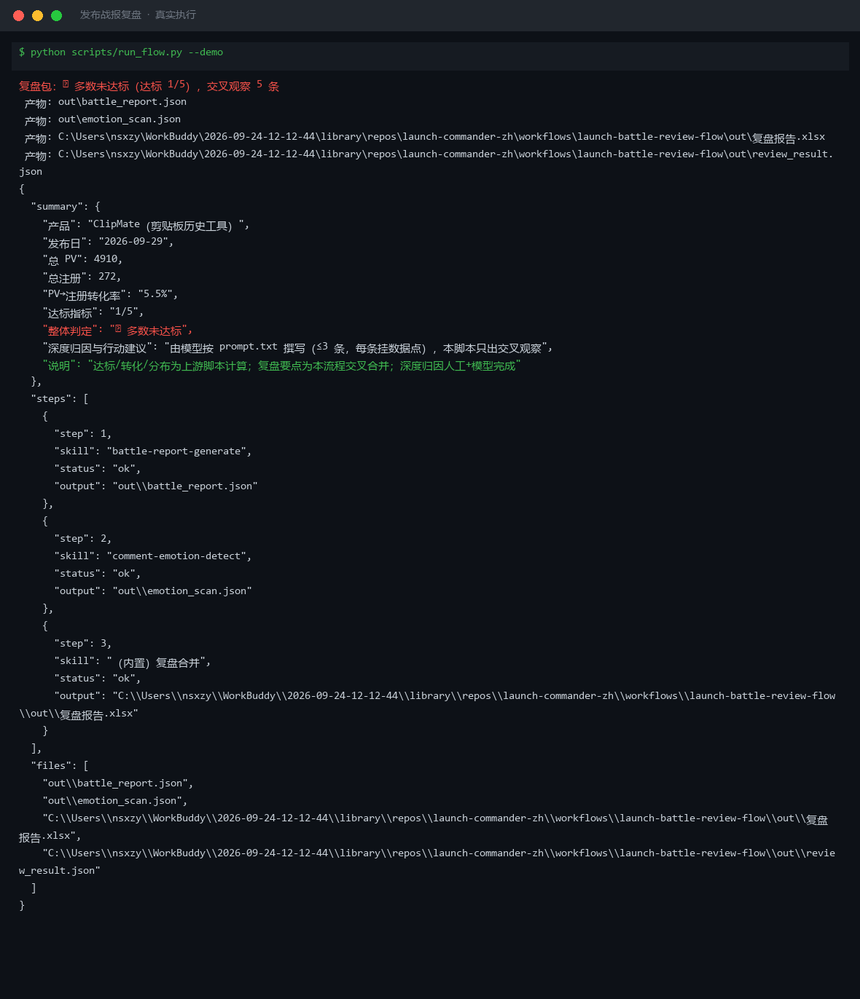
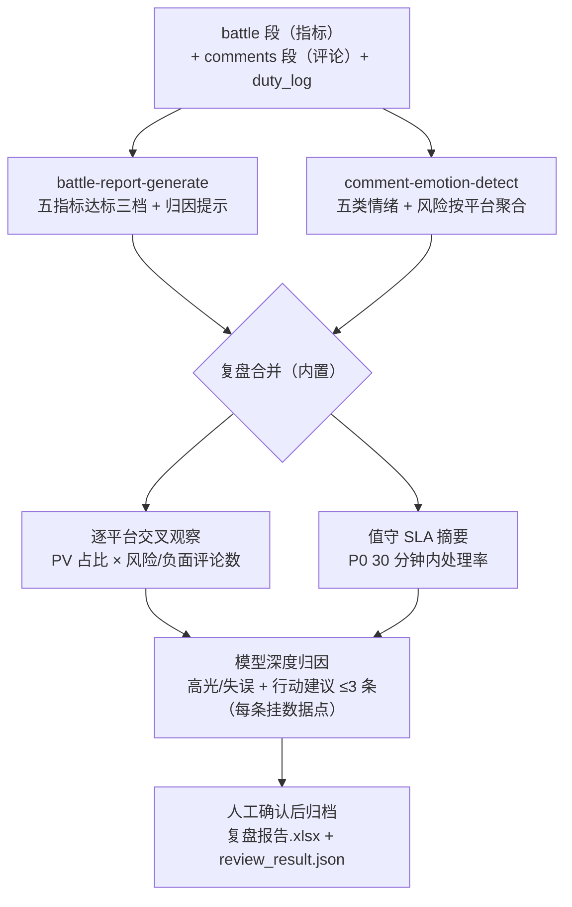

# 发布战报复盘 Launch Battle Review Flow

> 工作流（复合技能） ｜ 属于「发布指挥官」 ｜ OPC 客群（独立开发者/出海小团队） ｜ T3 编排型
>
> **发布日的两份原始记录——各平台指标和评论流——通常各看各的。本流程把它们合并成一份复盘包，并做流量-情绪交叉观察：「达标没有、问题在哪层」有数据答案而不是感觉。**
> 触发：事件（T+1 早上战报 + T+7 留存复盘）· 五指标达标判定 + 情绪统计 + 交叉观察 + 值守 SLA 摘要 · 深度归因由模型撰写 ≤3 条




🎬 **[▶ 观看高清完整版（mp4）](https://cdn.jsdelivr.net/gh/bangwozuo/launch-commander-zh@main/workflows/launch-battle-review-flow/docs/assets/demo.mp4)** — 四幕流转叙事：业务钩子 → 真实执行 → 数据管线节点动画 → 交付物

*上图来自真实执行：`python scripts/run_flow.py --demo` 退出码 0。ClipMate T+1 三路合并——总 PV 4910 / 注册 272（转化率 5.5%）、达标 1/5 判「🔴 多数未达标」、P0 30 分钟内处理 2/2，交叉观察 5 条，产物落盘复盘报告.xlsx。*

---

## 它做什么（三步编排）

| 步骤 | 执行位 | 处理 | 产出 |
|---|---|---|---|
| 1. 五指标战报 | `battle-report-generate`（脚本） | 达标三档判定（≥100%/70-100%/<70%）+ 平台占比与转化率 + 规则式归因提示（漏斗定位） | battle_report.json + 发布战报.xlsx + 2 张 PNG |
| 2. 评论情绪统计 | `comment-emotion-detect`（脚本） | 五类情绪 + 六类风险 + P0-P4 排队；按平台聚合风险/负面分布 | emotion_scan.json + 评论分类清单.xlsx + 情绪分布.png |
| 3. 复盘合并（内置） | 脚本 | 逐平台交叉：PV 占比 × 该平台风险/负面评论数 → 交叉观察；值守 SLA 摘要（P0 30 分钟内处理率） | 复盘报告.xlsx（复盘要点+汇总）+ review_result.json |

### 交叉观察规则（判定不看感觉）

- PV 占比 ≥50% 的平台若风险评论 >0 → 「流量主力且有风险——优先清风险」；风险=0 → 「守住响应节奏」
- 评论样本 <3 → 「样本少，情绪结论不下」
- 值守 SLA：P0 30 分钟内处理率（p0_within_30min/p0_total）——发布日响应速度进 PH 排名算法，这是复盘里唯一衡量「执行」而非「结果」的行
- 行动建议 ≤3 条，每条必须挂一个数据点，由模型撰写、人工确认

## 真实输入 → 真实输出

**输入**（`examples/input.json`）：battle 段（targets + 四平台指标 + 逐时 PV）+ comments 段（7 条评论）+ duty_log（P0 处理时长、回复条数）。

**输出**（复盘要点——流量 × 情绪交叉，脚本实跑）：

| 平台 | PV | PV占比 | 注册 | 评论样本 | 风险/负面 | 交叉观察 |
|---|---|---|---|---|---|---|
| ProductHunt | 3200 | 65% | 190 | 4 | 2/0 | 流量主力且有风险评论——优先清该平台风险 |
| V2EX | 980 | 20% | 45 | 2 | 0/0 | 样本少，情绪结论不下 |
| X/Twitter | 540 | 11% | 26 | — | — | — |
| 即刻 | 190 | 4% | 11 | 1 | 0/0 | 样本少，情绪结论不下 |
| （值守执行） | — | — | — | 41 | — | P0 30 分钟内处理 2/2；全日回复 5/41 条 |

汇总：达标 1/5、整体 🔴 多数未达标（四项 90%+ 贴线，waitlist 6% 失守）、PV→注册转化率 5.5%。PH 的两条风险评论（退款诉求 + 抄袭/刷榜指控）和「65% 流量主力」放在同一行——风险清不掉，流量主力就是负资产放大器。

深度归因（模型撰写示例，≤3 条）：waitlist 表单瘦身（转化层｜0.2% < 3% 基准）、X 晚间峰追推（流量层｜PV 98% 贴线）、存档提及与好评（传播层｜提及 4 次 ✅）。

完整输出见 [`examples/output.md`](examples/output.md)；实跑产物：`out/复盘报告.xlsx` + `out/review_result.json`（T+7 复盘复用）+ 上游战报/情绪全套产物。


## 处理流水线（DAG 节点 = 本仓真实 slug）



## 快速开始

**方式一：脚本（合并层，零 AI 依赖）**

```bash
pip install openpyxl matplotlib
python scripts/run_flow.py --demo                # 内置真实样例
python scripts/run_flow.py --input examples/input.json --outdir out
```

**方式二：提示词（归因层，任意 AI 工具）**

```text
1. 打开 prompt.txt，全文复制
2. 粘贴到 Coze / WorkBuddy / Dify / Claude / ChatGPT
3. 把 review_result.json 的交叉观察与 SLA 摘要喂给模型，
   按 battle-report-generate 的归因方法产出深度归因与行动建议
```

脚本不越权写结论：只出「漏斗层定位」提示，「高光/失误/建议」由模型+人工完成。失败处理：指标缺失但评论在 → 只出情绪复盘标注「补数据后复跑」；两者都缺 → 退出码 2。

## 面向谁 / 什么时候用

| ✅ 该用 | ❌ 别用 |
|---|---|
| T+1 战报 + T+7 留存复盘的两阶段合并 | 评论只有好评截图就下情绪结论（采样须覆盖 P0/P1 全量 + 其余随机） |
| 用交叉观察定位「流量主力平台的风险放大效应」 | 两套数据时间窗不齐硬对齐（交叉时标注各自窗口） |
| 值守执行量化（唯一衡量「执行」而非「结果」的行） | 脚本编造高光/失误叙事（无证据的归因越权） |

## 边界与合规

- 输出标注「AI 生成内容」；复盘含转化率等商业敏感项，对外分享前人工脱敏
- 评论样本属用户数据：复盘包内部使用，不外发；好评引用须获授权
- 不引用无授权第三方/竞品数据；单日数据不外推长期结论

## 文件地图

```text
├── README.md                ← 本文件
├── SKILL.md                 ← 资产定义（元信息 / 契约 / 边界）
├── prompt.txt               ← 提示词本体（三步编排 + 交叉规则 + 失败模式）
├── schema.json              ← 输入输出契约（机器可读）
├── scripts/run_flow.py      ← 编排脚本（调战报/情绪脚本 + 合并层）
├── examples/                ← 真实输入 + 脚本实跑输出
├── docs/                    ← 9 项配套文档（架构 / 流程 / 场景 / 测试报告…）
└── out/                     ← 实跑产物（复盘报告.xlsx / review_result.json）
```

---

*本资产遵循 [bangwozuo 数字员工资产规范](https://github.com/bangwozuo/digital-employee-spec) v3.0 ｜ [所属员工：发布指挥官](../../) ｜ [总入口](https://github.com/bangwozuo/digital-employees-hub-zh)*
