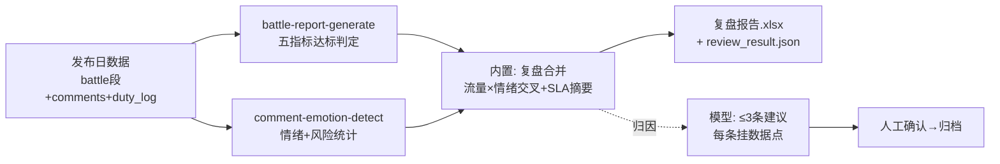

# 发布战报复盘流程

把发布日的两份原始记录（各平台指标 + 评论流）合并成一份复盘包：达标判定 +
情绪分布 + **流量×情绪交叉观察** + 值守 SLA 摘要。深度归因由模型撰写（≤3 条、
每条挂数据点），脚本不越权写结论。

## 元信息

| 字段 | 值 |
|------|-----|
| ID | `de_dev_02_wf05` |
| 类型 | **`composite`（复合技能/工作流）** |
| 所属员工 | 发布指挥官 |
| 阶段 | `P1` |
| 复杂度 | `S` |
| 触发方式 | 事件（T+1 战报；T+7 留存复盘复用） |
| ROI | 沉淀可复用发布资产；「问题在哪一层」有数据答案而不是感觉 |
| 资产形态 | 可跑编排脚本 + 深度流程提示词（无模型调用依赖、无 API Key） |

## 编排的原子技能

| # | 原子技能 | 能力 |
|---|---------|------|
| 1 | [战报生成](../../skills/battle-report-generate/) | 五指标达标判定+归因提示（scripts/battle_report.py） |
| 2 | [评论情绪识别](../../skills/comment-emotion-detect/) | 情绪分布+风险统计（scripts/emotion_scan.py） |

## 步骤链路（DAG）



## 步骤明细

| # | 步骤 | 技能资产 | 输入 | 输出 | 失败处理 |
|---|------|---------|------|------|---------|
| 1 | 五指标战报 | `battle-report-generate` | targets + platforms | battle_report.json + 战报 xlsx/PNG | 退出码≠0 中止；未设目标降级判定 |
| 2 | 评论情绪 | `comment-emotion-detect` | 评论流（P0/P1 全量+随机采样） | emotion_scan.json + 分类清单 | 空评论流标「0 评论」不阻断 |
| 3 | 复盘合并 | 本流程（内置） | 两份产物 + duty_log | 交叉观察 + SLA 摘要 + 复盘 xlsx | 指标/评论缺一 → 部分降级；都缺 → 退出码 2 |

## 输入规格

| 字段 | 类型 | 必填 | 说明 |
|------|------|------|------|
| `battle` | object | 二选一 | 战报段（targets/platforms/hourly_pv） |
| `comments` | array | 二选一 | 发布日评论流（P0/P1 全量 + 其余随机） |
| `duty_log` | object | ⬜ | 值守记录（P0/P1 处理时长、回复条数） |

## 输出规格

| 字段 | 类型 | 说明 |
|------|------|------|
| `review_rows` | array | 逐平台交叉观察（PV 占比 × 风险/负面；样本 <3 不下结论） |
| `summary` | object | 整体判定/达标 n/m/转化率/值守执行 |
| `attribution` | string | 模型撰写的 ≤3 条行动建议（每条挂数据点，人工确认） |
| `deliverable` | file | `out/复盘报告.xlsx` + 上游全套产物 |

## 错误处理

| 情况 | 处理方式 |
|------|---------|
| 任一上游退出码 ≠0 / 产物缺失 | 中止并打印 stderr |
| 指标缺失但评论在 | 只出情绪复盘，标「补数据后复跑」 |
| 评论缺失但指标在 | 只出战报，标「评论记录缺失」 |
| 两者都缺 | 退出码 2 |
| 值守记录缺失 | SLA 行标「未记录，建议下次记录」 |

## 使用步骤

### 方式一：跑脚本（端到端复盘包）

```bash
python3 <FLOW_DIR>/scripts/run_flow.py --input input.json --outdir out
python3 <FLOW_DIR>/scripts/run_flow.py --demo
```

### 方式二：手动编排（任意 AI 平台）

1. battle-report-generate 出达标表与归因提示；comment-emotion-detect 出情绪分布
2. 逐平台交叉（占比 ≥50% 且风险 >0 → 优先清风险；样本 <3 不下结论）
3. 模型按数据点写 ≤3 条建议 → 人工确认后归档

## 验收标准

- [x] DAG 节点为本仓真实技能 slug（双脚本串联）
- [x] 交叉观察规则量化（50%/样本 3 条线），主力平台风险自动置顶
- [x] 失败处理可演练（双缺/单缺/值守缺失/上游失败）
- [x] 深度归因不越权——脚本出提示，模型出建议，人工确认

## 边界（不做的事）

- ❌ 不代抓平台数据（后台导出由用户提供）
- ❌ 不编造归因——每条建议必须挂数据点，「感觉是因为」不写
- ❌ 单日数据不外推长期结论（留存看 T+7）
- ❌ 对外分享前人工脱敏（转化率等商业敏感项）

## 调用示例

**输入**（`examples/input.json`，节选）：

```json
{
  "battle": {"targets": {"pv": 5000, "signups": 300}, "platforms": [{"name": "ProductHunt", "pv": 3200, "signups": 190}]},
  "duty_log": {"p0_within_30min": 2, "p0_total": 2, "reply_total": 5, "comment_total": 41},
  "comments": [{"user": "angry_bob", "platform": "ProductHunt", "text": "Crashed twice. How do I get a refund?"}]
}
```

**输出**（run_flow.py 实跑，退出码 0）：达标 1/5 🔴；交叉观察 5 条（PH 主力+
风险置顶）；值守 P0 2/2。详见 examples/output.md。

## 所属工作流

本资产为复合技能（工作流）：评论数据来自 `daily-comment-duty-flow`（值守积累），
发布锚点来自 `publish-calendar-flow`；产物沉淀到 T+7 复盘。

## 合规声明

- 输出标注「AI 生成内容」；复盘结论人工确认后归档
- 转化率等商业敏感项外发前人工脱敏；评论样本属用户数据不外发
- 好评引用须获授权；不引用无授权第三方/竞品数据

---

*本技能遵循 [bangwozuo 数字员工资产规范](https://github.com/bangwozuo/digital-employee-spec) v3.0*
