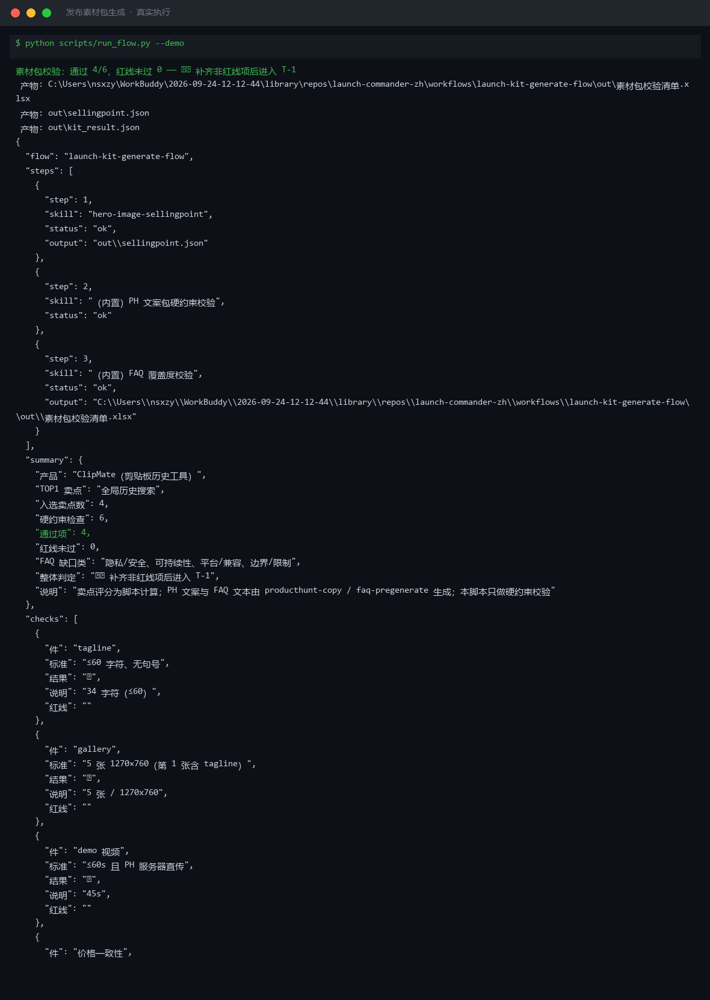
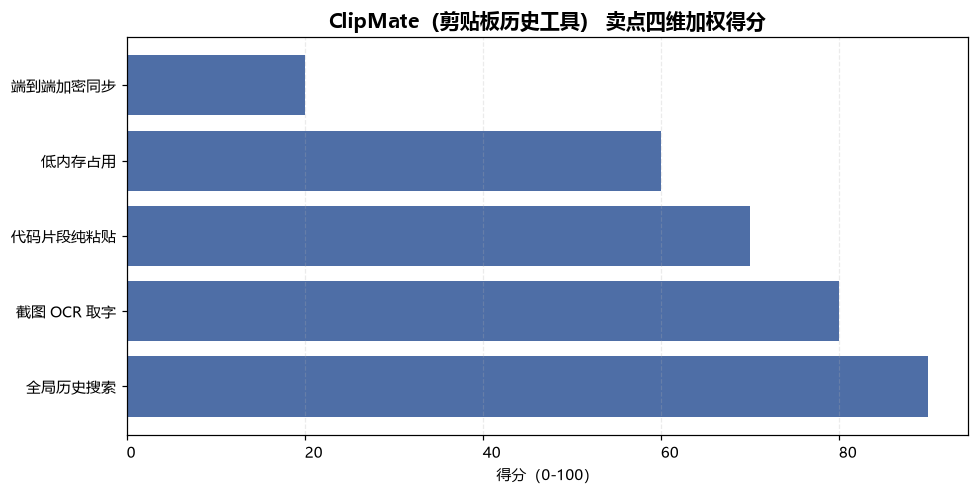
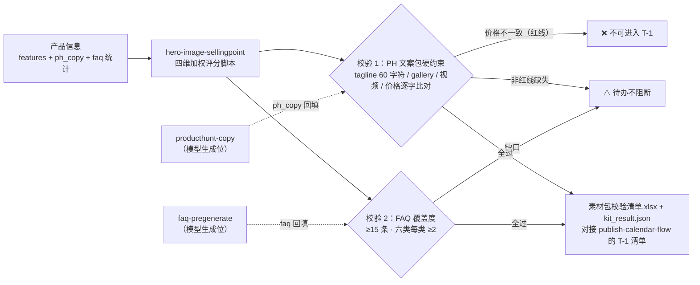

# 发布素材包生成 Launch Kit Generate Flow

> 工作流（复合技能） ｜ 属于「发布指挥官」 ｜ OPC 客群（独立开发者/出海小团队） ｜ T3 编排型
>
> **产品信息进，可直接上传的素材包出：PH 文案包 + 首图卖点 + FAQ 口径库三件套，外加硬约束校验——文案由模型写，尺寸、字数、价格一致性由脚本查。**
> 触发：人工（T-7 天启动）· 省 6-8h/次 ≈ ¥500-640/次 · tagline 超长、价格打架这类事故在 T-7 被拦住，而不是 T-1 深夜



*上图来自真实执行：`python scripts/run_flow.py --demo` 退出码 0。ClipMate 三件套校验——硬约束 6 项通过 4、红线未过 0、FAQ 只有 8 条（<15）判「⚠️ 补齐非红线项后进入 T-1」，卖点评分实跑入选 4 个（TOP1 = 全局历史搜索 90.0 分）。*

---

## 它校什么（三步编排 + 硬约束）

| 步骤 | 执行位 | 处理 | 产出 |
|---|---|---|---|
| 1. 卖点评分与首图方案 | `hero-image-sellingpoint`（脚本） | 四维加权（35%+25%+25%+15%）→ 入选规则（≥60 分且可演示，取前 5）→ GIF 分镜骨架 | sellingpoint.json + 卖点评分清单.xlsx + 对比 PNG |
| 2. PH 文案包硬约束校验 | 内置（脚本） | tagline ≤60 字符且无句号；gallery 5 张 1270×760；demo 视频 ≤60s；**价格三处逐字比对** | 「硬约束校验」sheet ✅/❌/缺失 |
| 3. FAQ 覆盖度校验 | 内置（脚本） | 总量 ≥15 条；六类质疑每类 ≥2；缺口列清单 | 校验项 + FAQ 缺口清单 |

`producthunt-copy` 与 `faq-pregenerate` 为文案/口径生成位（模型执行，产出回填 ph_copy 与 faq 字段后过校验）。红线判定：**价格不一致 → 整体「不可进入 T-1」**；FAQ 覆盖不足为非红线（⚠️ T-3 前补齐）。

### 量化规则（判定不看感觉）

- tagline ≤60 字符、gallery 5 张 1270×760、demo 视频 ≤60s——PH 机制的硬数字
- 价格一致性：**逐字比对**（「$8/mo」vs「$8/月」也算不一致——对外口径必须统一）
- 卖点入选：得分 ≥60 且 demoable=1，取前 5；首图主视觉 = TOP1
- FAQ：总量 ≥15、六类每类 ≥2（数量由本步查，质量/攻击性占比由 faq-pregenerate 保证）

## 真实输入 → 真实输出

**输入**（`examples/input.json`）：ClipMate 的 tagline/gallery/视频/三页价格/FAQ 统计 + 5 个功能四维分。

**输出**（硬约束校验，脚本实跑）：

| 件 | 标准 | 结果 | 说明 | 红线 |
|---|---|---|---|---|
| tagline | ≤60 字符、无句号 | ✅ | 34 字符（≤60） | |
| gallery | 5 张 1270×760 | ✅ | 5 张 / 1270x760 | |
| demo 视频 | ≤60s 且 PH 直传 | ✅ | 45s | |
| 价格一致性 | 官网/PH/README 逐字一致 | ✅ | 三处均为 Free + Pro $8/mo | |
| FAQ 总量 | ≥15 条 | ⚠️ 未达标 | 当前 8 条，T-3 前补齐 | |
| FAQ 六类覆盖 | 每类 ≥2 条 | ⚠️ 有缺口 | 缺：隐私/安全、可持续性、平台/兼容、边界/限制 | |

入选卖点（上游实跑）：全局历史搜索 90.0 / 截图 OCR 80.0 / 代码纯粘贴 70.0 / 低内存 60.0——TOP1 = 首图主视觉，文案包以「finally searchable」为纲（卖点先行，防文案与首图各说各话）。整体判定 **⚠️ 补齐非红线项后进入 T-1**。

完整输出见 [`examples/output.md`](examples/output.md)；实跑产物：`out/素材包校验清单.xlsx`、`out/kit_result.json`、上游 `out/卖点评分清单.xlsx` + `out/卖点评分对比.png`。



## 处理流水线（DAG 节点 = 本仓真实 slug）



## 快速开始

**方式一：脚本（校验层，零 AI 依赖）**

```bash
pip install openpyxl matplotlib
python scripts/run_flow.py --demo                # 内置真实样例
python scripts/run_flow.py --input examples/input.json --outdir out
```

**方式二：提示词（生成层，任意 AI 工具）**

```text
1. 打开 prompt.txt，全文复制
2. 粘贴到 Coze / WorkBuddy / Dify / Claude / ChatGPT
3. 模型产出三件套（卖点/文案/FAQ）回填输入字段，再跑脚本校验
```

校验绕过防线：模型自信「差不多 60 字符」不可信——字数/尺寸校验只认脚本结果；产出时限三件套 T-7 启动、T-3 定稿，每件素材 T-1 前过完本流程校验。

## 面向谁 / 什么时候用

| ✅ 该用 | ❌ 别用 |
|---|---|
| T-7 启动三件套、T-3 定稿前的硬约束把关 | 文案先写、卖点后定（顺序颠倒 = 文案与首图各说各话） |
| 拦截「价格只改了官网忘了 README」事故 | 模型自判字数/尺寸通过（只认脚本统计） |
| FAQ 数量缺口的显式清单（供人工审视质量） | FAQ 拿「如何下载」类温吞问题凑数（数量达标但 T-0 照样抓瞎） |

## 边界与合规

- 输出标注「AI 生成内容」；素材上传前人工终审
- 文案不编造数据、不含 incentivized 投票话术、不攻击竞品（各生成技能负责，本流程校验抽查）
- 价格与支付链接以官网为准；对外口径三处统一

## 文件地图

```text
├── README.md                ← 本文件
├── SKILL.md                 ← 资产定义（元信息 / 契约 / 边界）
├── prompt.txt               ← 提示词本体（三步编排 + 量化规则 + 失败模式）
├── schema.json              ← 输入输出契约（机器可读）
├── scripts/run_flow.py      ← 编排脚本（调上游评分脚本 + 两项内置校验）
├── examples/                ← 真实输入 + 脚本实跑输出
├── docs/                    ← 9 项配套文档（架构 / 流程 / 场景 / 测试报告…）
└── out/                     ← 实跑产物（素材包校验清单.xlsx / kit_result.json）
```

---

*本资产遵循 [bangwozuo 数字员工资产规范](https://github.com/bangwozuo/digital-employee-spec) v3.0 ｜ [所属员工：发布指挥官](../../) ｜ [总入口](https://github.com/bangwozuo/digital-employees-hub-zh)*
