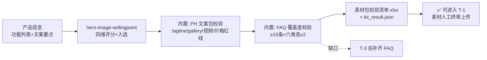

# 发布素材包生成流程

产品信息进，**可直接上传的素材包**出。文案由模型写，尺寸、字数、价格一致性由
脚本查——人不该在 T-3 深夜数像素。

## 元信息

| 字段 | 值 |
|------|-----|
| ID | `de_dev_02_wf01` |
| 类型 | **`composite`（复合技能/工作流）** |
| 所属员工 | 发布指挥官 |
| 阶段 | `P0` |
| 复杂度 | `S` |
| 触发方式 | 人工（T-7 天启动） |
| ROI | 省 6-8h/次 ≈ ¥500-640/次；tagline 超长/价格打架类事故提前 4 天拦截 |
| 资产形态 | 可跑编排脚本 + 深度流程提示词（无模型调用依赖、无 API Key） |

## 编排的原子技能

| # | 原子技能 | 能力 |
|---|---------|------|
| 1 | [首图卖点提炼](../../skills/hero-image-sellingpoint/) | 四维加权评分+入选+GIF 分镜（scripts/sellingpoint_score.py） |
| 2 | [Product Hunt 文案](../../skills/producthunt-copy/) | tagline/首评/gallery 配文（生成位） |
| 3 | [FAQ 预生成](../../skills/faq-pregenerate/) | 六类质疑口径库（生成位） |

## 步骤链路（DAG）



## 步骤明细

| # | 步骤 | 技能资产 | 输入 | 输出 | 失败处理 |
|---|------|---------|------|------|---------|
| 1 | 卖点评分 | `hero-image-sellingpoint` | 功能列表 | sellingpoint.json + 评分清单 | 退出码≠0 中止；入选 <3 列「素材不足」待办 |
| 2 | PH 硬约束校验 | 本流程（内置） | ph_copy 字段 | 逐项 ✅/❌/缺失 | 价格不一致=红线 → 不可进入 T-1 |
| 3 | FAQ 覆盖度 | 本流程（内置） | faq_total/categories | 缺口清单 | 覆盖不足 ⚠️ 非红线，T-3 前补齐 |

## 输入规格

| 字段 | 类型 | 必填 | 说明 |
|------|------|------|------|
| `features` | array | ✅ | 功能列表（四维评分输入） |
| `ph_copy` | object | ⬜ | tagline/gallery/视频时长/价格三处（producthunt-copy 产出后回填） |
| `faq_total` / `faq_categories` | number/object | ⬜ | FAQ 数量与六类分布 |

## 输出规格

| 字段 | 类型 | 说明 |
|------|------|------|
| `checks` | array | 六项硬约束逐项结果（价格项为红线） |
| `summary` | object | TOP1 卖点/入选数/通过项/整体判定 |
| `deliverable` | file | `out/素材包校验清单.xlsx`（❌ 与红线标红） |

## 错误处理

| 情况 | 处理方式 |
|------|---------|
| 上游脚本退出码 ≠0 / 产物缺失 | 中止并打印 stderr |
| tagline 缺失 | 标「缺失」列待办，不阻断 |
| 价格不一致 | 红线 → 整体判定「不可进入 T-1」 |
| FAQ 覆盖不足 | ⚠️ 非红线，缺口清单显式列出 |

## 使用步骤

### 方式一：跑脚本（端到端校验）

```bash
python3 <FLOW_DIR>/scripts/run_flow.py --input input.json --outdir out
python3 <FLOW_DIR>/scripts/run_flow.py --demo
```

### 方式二：手动编排（任意 AI 平台）

1. hero-image-sellingpoint 评分定 TOP 卖点
2. producthunt-copy 按 TOP 卖点写文案包；faq-pregenerate 生成口径库
3. 对照 prompt 中的硬约束清单逐项核对（字数/尺寸人工数，价格逐字比）

## 验收标准

- [x] DAG 节点为本仓真实技能 slug（hero-image-sellingpoint 脚本串联）
- [x] 六项硬约束脚本可查，红线（价格）可拦截
- [x] 失败处理可演练（上游失败/缺失/红线/FAQ 缺口）
- [x] 卖点先行——文案包以 TOP 卖点为纲，顺序不可倒

## 边界（不做的事）

- ❌ 不代写文案与 FAQ（生成位是 producthunt-copy / faq-pregenerate），只做编排与校验
- ❌ 模型不得自判字数/尺寸通过——只认脚本结果
- ❌ 价格以官网为准，三处逐字一致（$8/mo vs $8/月 也算不一致）
- ❌ 不给「差不多能发」的结论——判定只有三档（✅/⚠️/❌）

## 调用示例

**输入**（`examples/input.json`，节选）：

```json
{
  "product": "ClipMate（剪贴板历史工具）",
  "tagline": "Your clipboard, finally searchable",
  "price_pages": {"官网": "Free + Pro $8/mo", "ProductHunt": "Free + Pro $8/mo", "README": "Free + Pro $8/mo"},
  "faq_total": 8,
  "features": [{"name": "全局历史搜索", "demoable": 1, "wow": 5, "breadth": 5, "uniqueness": 3}]
}
```

**输出**（run_flow.py 实跑，退出码 0）：通过 4/6——tagline 34 字符 ✅、gallery ✅、
视频 45s ✅、价格三处一致 ✅；FAQ 8 条 ⚠️ 未达标（缺口：隐私/可持续/平台/边界）；
TOP1=全局历史搜索（入选 4）。整体判定「⚠️ 补齐非红线项后进入 T-1」。
详见 examples/output.md。

## 所属工作流

本资产为复合技能（工作流）：校验结果对接 `publish-calendar-flow` 的 T-1 清单
（本流程全绿是 T-1 的前提）。

## 合规声明

- 输出标注「AI 生成内容」；素材上传前人工终审
- 文案不编造数据、不含 incentivized 投票话术、不攻击竞品
- 价格与支付链接以官网为准；对外口径三处统一

---

*本技能遵循 [bangwozuo 数字员工资产规范](https://github.com/bangwozuo/digital-employee-spec) v3.0*
