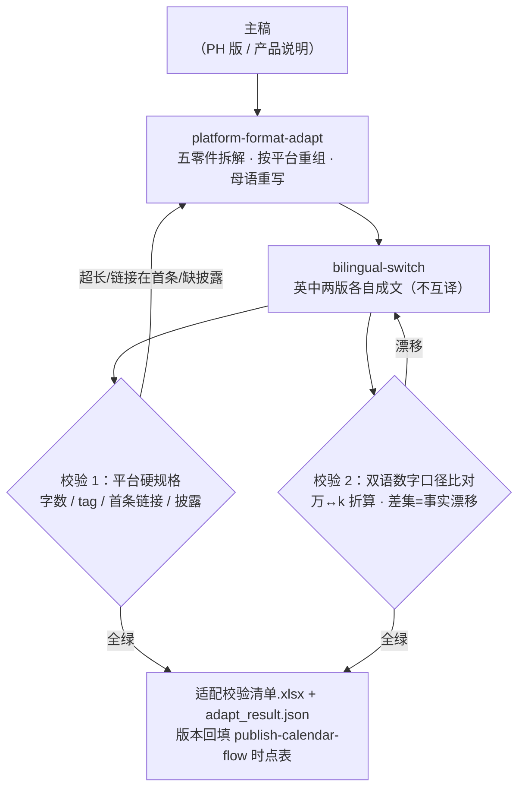

# 多平台文案适配 Multi Platform Copy Adapt Flow

> 工作流（复合技能） ｜ 属于「发布指挥官」 ｜ OPC 客群（独立开发者/出海小团队） ｜ T3 编排型
>
> **主稿进，五平台原生版本 + 校验全绿出。模型负责重写（platform-format-adapt + bilingual-switch），脚本负责模型做不了的机器校验：字数、tag 数、首条链接、披露声明、双语数字口径。**
> 触发：事件（主稿/卖点确认后，T-4 至 T-3）· 省 3h/次 ≈ ¥240/次 · 「发完才发现」三类事故全部前移到发布前拦截


🎬 **[▶ 观看高清完整版（mp4）](https://cdn.jsdelivr.net/gh/bangwozuo/launch-commander-zh@main/workflows/multi-platform-copy-adapt-flow/docs/assets/demo.mp4)** — 四幕创作叙事：业务钩子 → 真实执行 → 要点到成稿演变 → 交付物

*上图来自真实执行：`python scripts/run_flow.py --demo` 退出码 0。五平台版本校验——8 条规格检查未过 2（X 首条带链接 ❌、V2EX 标题 44 字超限 ❌，均为演示故意留的典型错误）、知乎未收录标 ⚠️、双语数字口径比对 ✅ 一致，判定「❌ 2 项未过，修正后复跑」。*

---

## 它校什么（两层机器校验）

### 层 1：平台硬规格校验（逐平台）

| 平台 | 检查项 | 未过的后果 |
|---|---|---|
| X | 正文 ≤280 字符 + tag ≤2 + **首条不带链接**（防降权） | 首条带链接 = 时间线降权 |
| V2EX | 标题 ≤40 字 | 超出量显式给出（超 1 字也是 ❌） |
| 即刻 | 正文 ≤500 字 | ❌ |
| 小红书 | 标题 ≤20 / 正文 ≤1000 字符 | ❌ |
| Reddit | 检查 **I made this 披露** | 被识破 = 版封 + 截图挂人 |
| 未收录平台 | 标「需人工核对官方规格」 | 不编造限制 |

### 层 2：双语数字口径比对（红线）

抽取 lang=en 与 lang=zh 全部版本的数字集合（中文「N万」折算与英文 100k 对齐）→ 比对差集。一边独有的数字 = 事实漂移。对齐明细（实跑）：0.3（s/秒）两边都有；10 万条 ↔ 100k entries 折算对齐；$8/mo ↔ $8/月 ↔ 8 美元归一为 8；第 7 次 ↔ 7th 两边都有。

## 真实输入 → 真实输出

**输入**（`examples/input.json`）：五平台版本（X/V2EX/即刻/小红书/知乎），含两处故意留的典型错误供演示拦截。

**输出**（规格校验节选，脚本实跑）：

| 平台 | 检查项 | 结果 | 说明 |
|---|---|---|---|
| X | 正文 ≤280 字 | ✅ | 225 字 |
| X | 首条不带链接（防降权） | ❌ 链接放回复 | 首条含链接 |
| V2EX | 标题 ≤40 字 | ❌ | 44 字，超出 4 |
| 小红书 | 标题 ≤20 字 / 正文 ≤1000 字 | ✅ | 13 字 / 99 字 |
| 知乎 | 规格收录 | ⚠️ | 平台未收录——需人工核对官方规格 |

两处 ❌ 的处置：X 版把 `Details: https://clipmate.site` 移到自己的回复（首条保持纯内容）；V2EX 标题压缩到 ≤40 字。修正后复跑至全绿。

完整输出见 [`examples/output.md`](examples/output.md)；实跑产物：`out/适配校验清单.xlsx`（规格校验/口径比对/汇总，❌ 标红）+ `out/adapt_result.json`（对接 publish-calendar-flow 排期）。

## 处理流水线（DAG 节点 = 本仓真实 slug）



## 快速开始

**方式一：脚本（校验层，零 AI 依赖）**

```bash
pip install openpyxl
python scripts/run_flow.py --demo                # 内置真实样例（含故意错误演示）
python scripts/run_flow.py --input examples/input.json --outdir out
```

**方式二：提示词（重写层，任意 AI 工具）**

```text
1. 打开 prompt.txt，全文复制
2. 粘贴到 Coze / WorkBuddy / Dify / Claude / ChatGPT
3. 模型按 platform-format-adapt 与 bilingual-switch 的方法产出 copies[]，再跑脚本校验
```

自判字数不可信——「差不多 280」与「实测 292」差一次限流；校验不过回到重写位修正，**不人工微调绕过**（字数超了就重写那一段）。

## 面向谁 / 什么时候用

| ✅ 该用 | ❌ 别用 |
|---|---|
| 主稿确认后发 3-5 平台前的最后一道机器检查 | 用模型自判代替脚本统计（自判字数不可信） |
| 双语版本发不同语言社区前的事实口径核对 | X 文案最后顺手贴链接（最常见降权原因，专治手滑） |
| Reddit 发帖前的披露检查（I made this） | 平台规格靠猜（未收录平台标「需人工核对官方」） |

## 边界与合规

- 输出标注「AI 生成内容」；各平台版本人工确认后发布
- Reddit 披露利益相关为硬要求，流程代查但责任在发布者
- 平台 AIGC 标识按现行要求执行；平台规格以官方最新为准

## 文件地图

```text
├── README.md                ← 本文件
├── SKILL.md                 ← 资产定义（元信息 / 契约 / 边界）
├── prompt.txt               ← 提示词本体（两层校验规则 + 量化口径 + 失败模式）
├── schema.json              ← 输入输出契约（机器可读）
├── scripts/run_flow.py      ← 编排脚本（规格校验 + 双语口径比对）
├── examples/                ← 真实输入 + 脚本实跑输出（含故意错误演示）
├── docs/                    ← 9 项配套文档（架构 / 流程 / 场景 / 测试报告…）
└── out/                     ← 实跑产物（适配校验清单.xlsx / adapt_result.json）
```

---

*本资产遵循 [bangwozuo 数字员工资产规范](https://github.com/bangwozuo/digital-employee-spec) v3.0 ｜ [所属员工：发布指挥官](../../) ｜ [总入口](https://github.com/bangwozuo/digital-employees-hub-zh)*
