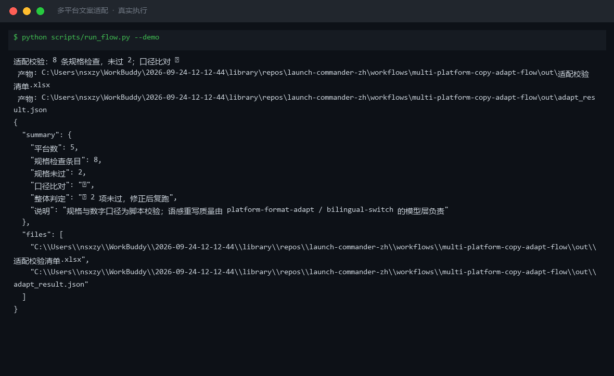

# 截图与录屏

> 以下素材均来自**真实执行**：`--run` 实拍终端 / 实跑产物文件，无摆拍。

## 演示视频


*Hyperframes 动态渲染 11s：命令逐字敲入（光标闪烁）→ 17 行真实输出逐行流式 → 完成态保持*

## 执行截图



## 实跑产物

| 文件 | 说明 |
|---|---|
| [`out/_demo_input.json`](out/_demo_input.json) | 结构化结果（实跑生成） · 2 KB |
| [`out/adapt_result.json`](out/adapt_result.json) | 结构化结果（实跑生成） · 2 KB |
| [`out/适配校验清单.xlsx`](out/适配校验清单.xlsx) | Excel 工作簿（实跑生成） · 7 KB |


---

## 附录：实跑输出明细

> 本资产为纯提示词客户端资产，无界面可截图。以下为**实跑运行效果**。

## 运行效果

### 输入

```json
{
  "input": "请提供工作流的初始输入数据"
}

```

### 输出

## 执行摘要

初始输入为占位提示，缺少原始文案与目标平台要求，工作流无法继续执行。

> **AI 生成内容**

## 分步结果

1. 步骤 1：平台格式适配 — 跳过，原因：无 content/target/platform 可输入。
2. 步骤 2：中英双语切换 — 跳过，原因：上一步无输出，且无 content/target_lang 可输入。

## 最终交付物

无。请提供需要适配的原始文案及目标平台信息后重新执行。


---

*运行效果由实跑验证生成*
