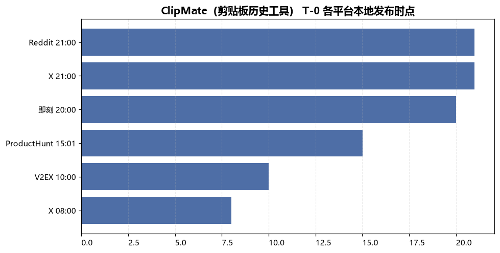
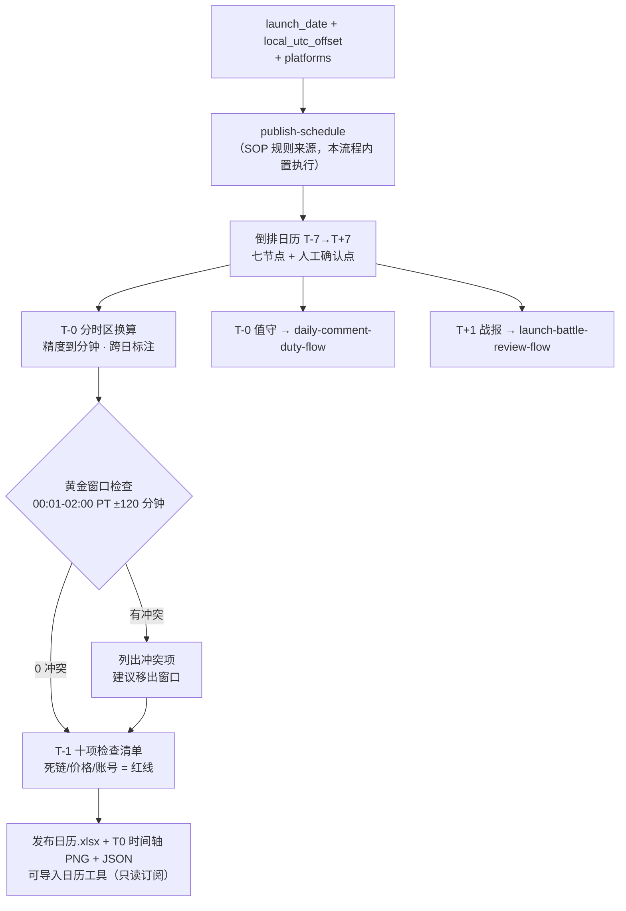

# 发布日历排期 Publish Calendar Flow

> 工作流（复合技能） ｜ 属于「发布指挥官」 ｜ OPC 客群（独立开发者/出海小团队） ｜ T3 编排型
>
> **以发布日 T0 为锚，把 publish-schedule 的 SOP 规则倒排出可执行日历：每节点带人工确认点，每平台时点换算成本地时间，PH 黄金窗口自动保护。发布动作零自动化。**
> 触发：人工（T-3 天启动）· 省 2h/次 ≈ ¥160/次 · 时区换算精度到分钟 · 跨日显式标注 · Reddit 周末自动顺延周一


🎬 **[▶ 观看高清完整版（mp4）](https://cdn.jsdelivr.net/gh/bangwozuo/launch-commander-zh@main/workflows/publish-calendar-flow/docs/assets/demo.mp4)** — 四幕流转叙事：业务钩子 → 真实执行 → 数据管线节点动画 → 交付物

*上图来自真实执行：`python scripts/run_flow.py --demo` 退出码 0。ClipMate 发布日 2026-09-29（周二）、开发者 UTC+8——5 平台 6 条时点全部换算（00:01 PT = 本地 15:01），黄金窗口冲突 0 个，产物落盘发布日历.xlsx + T0 时间轴 PNG + JSON。*

---

## 它排什么（三步编排）

| 步骤 | 处理 | 产出 |
|---|---|---|
| 1. 倒排日历生成 | 以 T0 为锚倒排七节点：T-7 预热 → T-3 定稿（文案包+FAQ≥15条+多平台版）→ T-1 十项预检 → T-0 分时区发布 → T+1 战报 → T+7 复盘；每节点带人工确认点 | 「倒排日历」sheet + publish_calendar.json |
| 2. T-0 分时区时点表 | 各平台时点（PH 00:01 PT / X 双峰 / Reddit 工作日 8-10AM EST / V2EX 上午10点 / 即刻等晚 8-10 点 CST）→ 换算本地日期时间；标跨日；黄金窗口冲突检查；周末 Reddit 顺延周一 | 「T0时点表」sheet + 发布日T0时间轴.png |
| 3. T-1 检查清单与升降级 | 十项清单落表（第 1/6/7 项红线：死链、价格不一致、账号异常）；预置升级/降级/中止规则 | 「T1检查清单」sheet（红线行标红）+「黄金窗口冲突」sheet |

### 量化规则（判定不看感觉）

- 时点换算精度到分钟；跨日事件显式标注（如 PT 午夜 = 本地次日下午）
- PH 黄金窗口 = 00:01-02:00 PT 的本地时段，**窗口内 ±120 分钟不排其他平台动作**
- Reddit 仅工作日发布，周末自动顺延下一个周一
- T-3 硬门槛：FAQ 口径库 ≥15 条才允许进入 T-1；不达标 → T-3 延期而不是砍 FAQ
- 闹钟规则：PH 上线时刻前 30/10/0 分钟各一个，共 3 个

## 真实输入 → 真实输出

**输入**（`examples/input.json`）：发布日 2026-09-29、本地 UTC+8、五平台、waitlist 812。

**输出**（T-0 时点表节选，脚本实跑）：

| 平台 | 本地日期 | 本地时间 | 动作 | 备注 |
|---|---|---|---|---|
| ProductHunt | 2026-09-29 | 15:01 | 上线 + 30 分钟内发 maker comment | 闹钟 ×3（T-30/T-10/T0）；=00:01 PT |
| X | 2026-09-29 | 21:00 | 第一峰 thread（链接放回复） | =09:00 EST |
| X | 2026-09-30 | 08:00 | 第二峰带图追推，联动 PH 冲榜 | **跨日**；=20:00 EST |
| Reddit | 2026-09-29 | 21:00 | 经验分享帖 + I made this 披露 | =09:00 EST，工作日带内 |
| V2EX | 2026-09-29 | 10:00 | 分享节点发帖 | 上午 10 点，进首页 4-6 小时有效 |
| 即刻 | 2026-09-29 | 20:00 | 开发花絮帖 + 圈子话题 | — |

黄金窗口冲突：**0 个**（V2EX 10:00 在窗口前，X/即刻在窗口后 ≥120 分钟）。

完整输出见 [`examples/output.md`](examples/output.md)；实跑产物：

| 产物 | 内容 |
|---|---|
| `out/发布日历.xlsx` | 倒排日历 / T0时点表 / T1检查清单 / 黄金窗口冲突 四 sheet |
| `out/发布日T0时间轴.png` | 发布日各平台时点时间轴 |
| `out/publish_calendar.json` | 机器可读，向 launch-battle-review-flow 传递发布日锚点 |



## 处理流水线（DAG 节点 = 本仓真实 slug）



## 快速开始

**方式一：脚本（零 AI 依赖）**

```bash
pip install openpyxl matplotlib
python scripts/run_flow.py --demo                # 内置真实样例
python scripts/run_flow.py --input examples/input.json --outdir out
```

**方式二：提示词（任意 AI 工具）**

```text
1. 打开 prompt.txt，全文复制
2. 粘贴到 Coze / WorkBuddy / Dify / Claude / ChatGPT
3. 提供 launch_date（ISO 日期）+ 时区偏移 + 平台列表
```

launch_date 缺失/非法 → 退出码 2 打印修复提示，**不编造日期**。

## 面向谁 / 什么时候用

| ✅ 该用 | ❌ 别用 |
|---|---|
| T-3 前把「几点干什么」从记忆变成日程 | 自动发布（脚本产出的是「谁、几点、干什么」的表，不是发布器） |
| 跨时区发布（PT/EST/CST 换算 + 夏令时复核） | 日历工具授予写权限（只导只读订阅，防自动改期打乱节点） |
| Reddit 周末顺延、黄金窗口冲突自动拦截 | 确认点批处理（T-3 FAQ 口径逐条确认，不许合并勾选） |

## 边界与合规

- 输出标注「AI 生成内容」；日历与清单仅提醒与检查，发布动作人工执行
- 不用 incentivized 手段凑首发势能；Reddit 披露利益相关；中文平台 AIGC 标识按现行要求
- 时点为经验基线，以平台官方最新规则为准；跨夏令时切换日的发布必须人工复核换算

## 文件地图

```text
├── README.md                ← 本文件
├── SKILL.md                 ← 资产定义（元信息 / 契约 / 边界）
├── prompt.txt               ← 提示词本体（三步编排 + 量化规则 + 失败模式）
├── schema.json              ← 输入输出契约（机器可读）
├── scripts/run_flow.py      ← 编排脚本（倒排日历 + 时区换算 + 清单）
├── examples/                ← 真实输入 + 脚本实跑输出
├── docs/                    ← 9 项配套文档（架构 / 流程 / 场景 / 测试报告…）
└── out/                     ← 实跑产物（发布日历.xlsx / 发布日T0时间轴.png）
```

---

*本资产遵循 [bangwozuo 数字员工资产规范](https://github.com/bangwozuo/digital-employee-spec) v3.0 ｜ [所属员工：发布指挥官](../../) ｜ [总入口](https://github.com/bangwozuo/digital-employees-hub-zh)*
