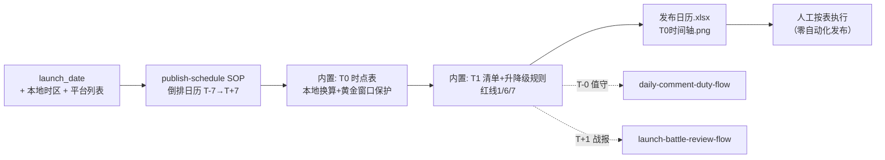

# 发布日历排期流程

以 T0 为锚倒排「发布日到底几点干什么」：日历 + 本地时点表 + 检查清单 +
升降级规则。发布动作零自动化——产出的是「谁、几点、干什么」的表，不是发布器。

## 元信息

| 字段 | 值 |
|------|-----|
| ID | `de_dev_02_wf03` |
| 类型 | **`composite`（复合技能/工作流）** |
| 所属员工 | 发布指挥官 |
| 阶段 | `P0` |
| 复杂度 | `S` |
| 触发方式 | 人工（T-3 天启动） |
| ROI | 省 2h/次 ≈ ¥160/次；时区算错/忘设闹钟类事故归零 |
| 资产形态 | 可跑编排脚本 + SOP 规则内置（无模型调用、无 API Key） |

## 编排的原子技能

| # | 原子技能 | 能力 |
|---|---------|------|
| 1 | [发布排期](../../skills/publish-schedule/) | T4 SOP：倒排时间轴 / T-1 清单 / T-0 时点表 / 升降级规则 |

## 步骤链路（DAG）



## 步骤明细

| # | 步骤 | 技能资产 | 输入 | 输出 | 失败处理 |
|---|------|---------|------|------|---------|
| 1 | 倒排日历 | `publish-schedule`（SOP 内置） | launch_date | 日历 6 节点（含星期） | 日期非法 → 退出码 2 不编造 |
| 2 | T0 时点表 | 本流程（换算+窗口保护） | platforms + 时区 | 本地时点 6 条 + 时间轴图 | 未收录平台标待补充；周末 Reddit 顺延周一；跨夏令时人工复核 |
| 3 | T1 清单与升降级 | 本流程（SOP 判断层） | 步骤 1/2 产物 | 十项清单（红线 1/6/7）+ 规则 | 结果人工回填；红线未过延后 24h |

## 输入规格

| 字段 | 类型 | 必填 | 说明 |
|------|------|------|------|
| `launch_date` | string | ✅ | ISO 日期（星期几影响 Reddit 规则） |
| `local_utc_offset` | integer | ⬜ | 本地 UTC 偏移，默认 8 |
| `platforms` | array | ⬜ | 平台列表，默认五平台 |
| `waitlist_size` | integer | ⬜ | 升降级阈值用 |

## 输出规格

| 字段 | 类型 | 说明 |
|------|------|------|
| `calendar` | array | 倒排日历（节点/日期/星期/动作/确认点/状态） |
| `slots` | array | T-0 时点表（本地换算，跨日标注） |
| `checklist` | array | T-1 十项清单（红线标红） |
| `conflicts` | array | PH 黄金窗口冲突项 |
| `deliverable` | file | `out/发布日历.xlsx` + `out/发布日T0时间轴.png` |

## 错误处理

| 情况 | 处理方式 |
|------|---------|
| launch_date 缺失/非法 | 退出码 2 + 修复提示，不编造日期 |
| 发布日为周末 | Reddit 顺延下一周一并标注 |
| 平台未收录 | 保留并标「待人工补充时点」 |
| 夏令时切换日 | 按基线偏移计算并标注人工复核 |
| 黄金窗口冲突 | 列出冲突项并建议移出 |

## 使用步骤

### 方式一：跑脚本（端到端）

```bash
python3 <FLOW_DIR>/scripts/run_flow.py --input input.json --outdir out
python3 <FLOW_DIR>/scripts/run_flow.py --demo
```

### 方式二：手动编排（任意 AI 平台）

1. 把 publish-schedule 的 prompt 贴为系统提示词，提供发布日与时区
2. 按 SOP 输出手动核对时点换算与清单
3. 导入日历工具为**只读订阅**；T-1 起逐项打勾

## 验收标准

- [x] DAG 节点为本仓真实技能 slug（publish-schedule）
- [x] 时区换算与手工核对零偏差，跨日显式标注
- [x] 失败处理可演练（非法日期/周末顺延/未收录平台/夏令时）
- [x] 发布动作零自动化，确认点逐节点齐备

## 边界（不做的事）

- ❌ 不自动发布、不代点发布按钮；日历工具只读订阅
- ❌ T-1 红线未过不「先发再说」
- ❌ 不编造未收录平台的时点
- ❌ 不建议 incentivized 手段凑首发势能

## 调用示例

**输入**（`examples/input.json`）：

```json
{
  "product": "ClipMate（剪贴板历史工具）",
  "launch_date": "2026-09-29",
  "local_utc_offset": 8,
  "platforms": ["ProductHunt", "X", "Reddit", "V2EX", "即刻"]
}
```

**输出**（run_flow.py 实跑，退出码 0）：PH 本地 15:01、X 双峰 21:00/次日 08:00（跨日）、
黄金窗口冲突 0；倒排日历 T-7=09-22 至 T+7=10-06。详见 examples/output.md。

## 所属工作流

本资产为复合技能（工作流）：T-0 值守接力 `daily-comment-duty-flow`，
T+1 战报接力 `launch-battle-review-flow`。

## 合规声明

- 输出标注「AI 生成内容」；发布动作全部人工执行
- 不用 incentivized 手段；Reddit 披露利益相关；中文平台 AIGC 标识按现行要求
- 时点为经验基线，以平台官方最新规则为准

---

*本技能遵循 [bangwozuo 数字员工资产规范](https://github.com/bangwozuo/digital-employee-spec) v3.0*
