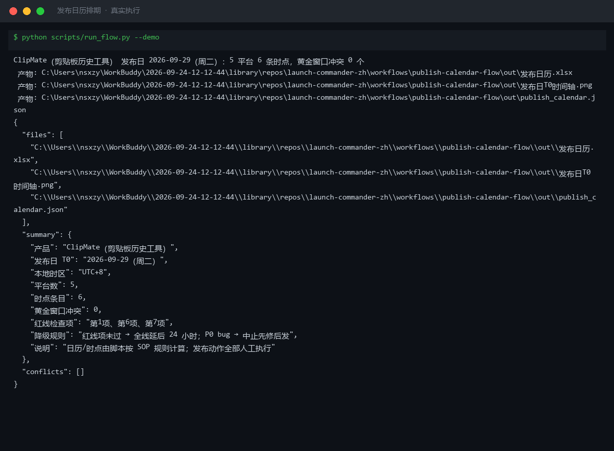

# 截图与录屏

> 以下素材均来自**真实执行**：`--run` 实拍终端 / 实跑产物文件，无摆拍。

## 演示视频


*第二帧为实跑产物图表*

## 执行截图



## 实跑产物

| 文件 | 说明 |
|---|---|
| [`out/publish_calendar.json`](out/publish_calendar.json) | 结构化结果（实跑生成） · 5 KB |
| [`out/发布日T0时间轴.png`](out/发布日T0时间轴.png) | 图表产物（实跑生成） · 31 KB |
| [`out/发布日历.xlsx`](out/发布日历.xlsx) | Excel 工作簿（实跑生成） · 10 KB |


---

## 附录：实跑输出明细

> 本资产为纯提示词客户端资产，无界面可截图。以下为**实跑运行效果**。

## 运行效果

### 输入

```json
{
  "input": "请提供工作流的初始输入数据"
}

```

### 输出

## 执行摘要

初始输入为占位提示，缺少待排期条目与约束条件，工作流无法继续执行。

> **AI 生成内容**

## 分步结果

1. 步骤 1：发布排期 — 跳过，原因：无 items/constraints 可输入。

## 最终交付物

无。请提供待排期条目（含时长/优先级/平台等约束）及时间约束后重新执行。


---

*运行效果由实跑验证生成*
